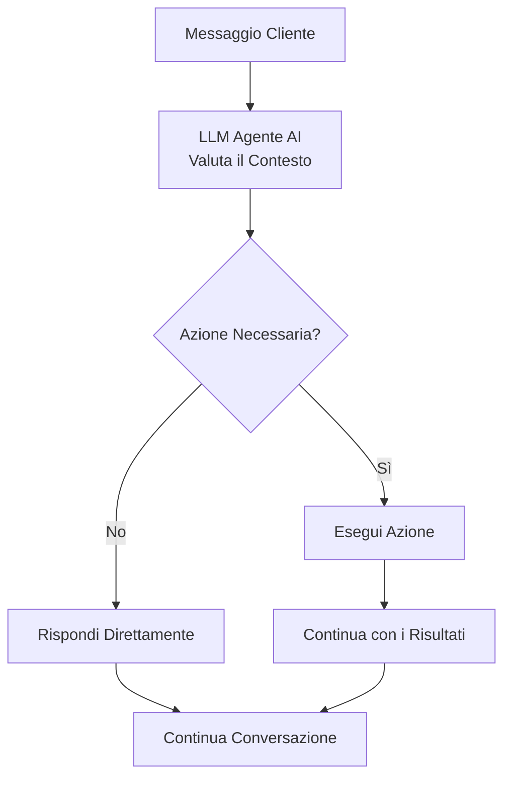

## Panoramica

Le azioni trasformano i tuoi agenti AI da assistenti solo conversazionali in potenti strumenti di automazione aziendale. Oltre a rispondere alle domande, i tuoi agenti possono pianificare appuntamenti, trasferire chiamate, aggiornare sistemi e integrarsi con i tuoi flussi di lavoro aziendali esistenti - tutto mantenendo un flusso di conversazione naturale.

Pensa alle azioni come al kit di strumenti del tuo agente. Proprio come un dipendente umano utilizza diversi strumenti per completare le attività, il tuo agente AI esegue azioni per svolgere lavoro reale durante le interazioni con i clienti.

<Note>
Le azioni si eseguono automaticamente in base al contesto della conversazione e alle istruzioni che fornisci nel prompt del tuo agente. Definisci quando e come le azioni devono essere utilizzate attraverso l'[ingegneria del prompt](/it/build/conversation/prompt-engineering-guide).
</Note>

---

## Cosa sono le Azioni?

Le azioni sono strumenti preconfigurati che il tuo agente può invocare durante le conversazioni per compiere attività specifiche. Quando un cliente richiede qualcosa che richiede un'azione - come prenotare un appuntamento o parlare con uno specialista - il tuo agente può eseguire l'azione appropriata in modo fluido.

### Come Funzionano le Azioni

Durante le conversazioni, il tuo agente decide autonomamente se rispondere direttamente o eseguire un'azione:



L'agente utilizza **nomi e descrizioni delle azioni** per comprendere cosa fa ciascuna azione. Questi sono cruciali per aiutare il LLM a selezionare lo strumento giusto.

**Best practice:**
- Assegna alle azioni nomi chiari e descrittivi (es. "prenota_appuntamento" non "azione1")
- Scrivi descrizioni dettagliate che spiegano cosa fa l'azione
- Aggiungi istruzioni esplicite nelle tue [istruzioni agente (prompt di sistema)](/it/build/conversation/prompt-engineering-guide) su **quando** utilizzare ogni azione

<Note>
Mentre i nomi e le descrizioni delle azioni indicano all'agente **cosa** fa un'azione, le tue istruzioni agente (prompt di sistema) dovrebbero specificare **quando** utilizzarla. Ad esempio: "Quando un cliente chiede di parlare con un umano, usa l'azione transfer_to_support."
</Note>

---

## Categorie di Azioni

Le azioni sono organizzate in due categorie nella dashboard:

### Controllo Chiamata

<CardGroup cols={2}>
  <Card title="Trasferisci Chiamata" icon="phone" href="/it/build/actions/transfer-details">
    Trasferisci ad un altro agente AI, numero di telefono o indirizzo SIP
  </Card>
  <Card title="Termina Conversazione" icon="phone-slash" href="/it/build/actions/call-control">
    Fai in modo che l'agente termini la conversazione con un messaggio personalizzato
  </Card>
</CardGroup>

### Integrazione

<CardGroup cols={2}>
  <Card title="Azione Personalizzata" icon="code" href="/it/build/actions/custom-api-actions">
    Crea un'azione API o webhook personalizzata
  </Card>
  <Card title="Prenotazione Calendario" icon="calendar" href="/it/build/actions/booking-calendar">
    Pianifica appuntamenti utilizzando l'integrazione Cal.com
  </Card>
</CardGroup>

---

## Quando si Eseguono le Azioni

Le azioni si eseguono **durante la conversazione** quando attivate dal tuo agente in base alle sue istruzioni. A differenza dei sistemi IVR tradizionali che seguono script rigidi, gli agenti AI utilizzano la comprensione contestuale per determinare quando le azioni sono appropriate.

### Meccanismi di Attivazione

**Trigger Basati su Istruzioni:**
```text wrap
Quando il cliente chiede di parlare con un umano, usa l'azione 'Trasferisci al Supporto'.

Dopo aver prenotato con successo un appuntamento, usa l'azione 'Termina Chiamata Cortesemente'.

Se il cliente dice che ha bisogno di tempo per controllare qualcosa, usa l'azione 'Metti in Pausa Timer Inattività'.
```

**Trigger Condizionali:**
```jinja
Se il cliente segnala un problema di fatturazione:
1. Usa l'azione 'Cerca Account' per recuperare le sue informazioni
2. Se il saldo è scaduto, trasferisci al reparto fatturazione
3. Se il saldo è corrente, risolvi il problema


Offri sempre di trasferire immediatamente i clienti VIP al supporto dedicato.

```

**Flussi di Lavoro Multi-Step:**
```text wrap
Flusso Prenotazione Appuntamento:
1. Raccogli le informazioni richieste (nome, email, data preferita)
2. Usa l'azione 'Verifica Disponibilità' per interrogare Cal.com
3. Presenta le opzioni al cliente
4. Usa l'azione 'Prenota Appuntamento' per confermare
5. Usa l'azione 'Invia Conferma SMS' se il cliente ha fornito il telefono
6. Usa l'azione 'Termina Chiamata Cortesemente' per concludere
```

<Warning>
Le azioni si eseguono in tempo reale durante la chiamata. Assicurati che i tuoi endpoint siano affidabili e rispondano rapidamente per evitare pause imbarazzanti nella conversazione.
</Warning>

---

## Configurare le Azioni

Tutta la configurazione delle azioni avviene nell'editor agente sotto la scheda **Abilità → Azioni**.

<Steps>
  <Step title="Vai a Azioni">
    Apri il tuo agente nell'editor e clicca su **Abilità** → scheda **Azioni**
  </Step>
  <Step title="Scegli Tipo di Azione">
    Sfoglia le categorie **Controllo Chiamata** e **Integrazione** e clicca su **Aggiungi** sull'azione che vuoi configurare
  </Step>
  <Step title="Configura Azione">
    Compila il modulo di configurazione specifico dell'azione:
    - **Nome**: Assegna all'azione un nome chiaro e descrittivo
    - **Descrizione**: Spiega cosa fa questa azione
    - **Impostazioni specifiche dell'azione**: Configura i parametri in base al tipo di azione
  </Step>
  <Step title="Salva">
    Salva l'azione per aggiungerla al kit di strumenti del tuo agente
  </Step>
</Steps>

---

## Indicatori di Stato Azione

Dopo aver aggiunto azioni, le vedrai elencate nella scheda Azioni del tuo agente con indicatori di stato:

<CardGroup cols={3}>
  <Card title="Configurata" icon="circle-check">
    L'azione è configurata correttamente e pronta all'uso
  </Card>
  <Card title="Incompleta" icon="circle-exclamation">
    Manca configurazione o credenziali richieste
  </Card>
  <Card title="Errore" icon="circle-xmark">
    Errore di configurazione o fallimento autenticazione
  </Card>
</CardGroup>

---

## Riferire le Azioni nelle Istruzioni

Per utilizzare le azioni, riferiscile **per nome esatto** nelle istruzioni del tuo agente:

### Riferimento Diretto
```text wrap
Quando un cliente chiede di parlare con qualcuno riguardo alla fatturazione,
usa l'azione 'Trasferisci al Reparto Fatturazione'.
```

### Con Condizioni
```text wrap
Se il problema del cliente non può essere risolto:
1. Scusati per l'inconveniente
2. Spiega che stai connettendolo a uno specialista
3. Usa l'azione 'Trasferisci al Supporto'
```

### Con Parametri
```text wrap
Dopo aver raccolto l'email del cliente e la data preferita,
usa l'azione 'Prenota Consultazione' per pianificare l'incontro.
```

<Note>
I nomi delle azioni sono sensibili alle maiuscole e devono corrispondere esattamente come configurato. Se rinomini un'azione, aggiorna tutti i riferimenti nelle tue istruzioni.
</Note>

---

## Best Practice di Configurazione

<AccordionGroup>
  <Accordion title="Inizia Semplice" icon="seedling">
    Inizia con azioni di base prima di aggiungere integrazioni complesse. Aggiungi un'azione alla volta, testa accuratamente, poi aggiungi la successiva.

    **Esempio di progressione:**
    1. Aggiungi azione Termina Conversazione
    2. Aggiungi azione Trasferisci al Supporto
    3. Aggiungi azione Prenotazione
    4. Aggiungi azioni API Personalizzate
  </Accordion>

  <Accordion title="Usa Nomi Chiari e Descrittivi" icon="tag">
    I nomi delle azioni sono critici - il LLM li usa per comprendere cosa fa ciascuno strumento. Usa nomi descrittivi e orientati all'azione che trasmettono chiaramente lo scopo della funzione.

    **Perché è importante:** Il modello si basa sui nomi e descrizioni delle funzioni per rilevare quando una funzione deve essere chiamata e scegliere lo strumento giusto per l'attività.

    **Nomi buoni:**
    - "Ottieni Account Cliente" - Verbo d'azione chiaro + obiettivo specifico
    - "Trasferisci al Reparto Fatturazione" - Destinazione specifica inclusa
    - "Prenota Consultazione 30 Minuti" - Include dettagli rilevanti

    **Nomi scadenti:**
    - "Azione 1" - Nessun contesto su cosa fa
    - "Trasferisci" - Troppo generico, poco chiaro dove
    - "Chiamata API" - Non descrive l'azione
  </Accordion>

  <Accordion title="Scrivi Descrizioni Dettagliate" icon="file-lines">
    Le descrizioni delle azioni aiutano il LLM a comprendere **cosa** fa l'azione. La descrizione dovrebbe spiegare lo scopo dell'azione, cosa restituisce e quali parametri utilizza.

    **Best practice da [OpenAI function calling](https://platform.openai.com/docs/guides/function-calling):**
    - Descrivi chiaramente cosa fa l'azione e cosa restituisce
    - Spiega quali parametri o dati utilizza
    - Usa un linguaggio preciso che guidi la comprensione del modello
    - Mantienila concisa ma completa

    **Esempio:**
    ```
    Nome: Ottieni Account Cliente
    Descrizione: Recupera i dati dell'account cliente da Salesforce CRM utilizzando
    il loro numero di telefono. Restituisce stato account, saldo e ordini recenti.
    ```

    **Nota:** Descrivi **cosa** fa l'azione nella descrizione. Specifica **quando** utilizzarla nelle tue [istruzioni agente (prompt di sistema)](/it/build/conversation/prompt-engineering-guide).
  </Accordion>

  <Accordion title="Testa Accuratamente" icon="vial">
    Testa ogni azione nell'interfaccia di test agente prima di andare live:
    - Verifica che l'azione si esegua correttamente
    - Testa scenari di successo
    - Testa scenari di fallimento
    - Verifica la gestione degli errori
    - Controlla il flusso della conversazione
  </Accordion>

  <Accordion title="Gestisci i Fallimenti con Grazia" icon="shield-check">
    Configura comportamenti di fallback per quando le azioni falliscono. Istruisci il tuo agente su cosa fare quando le azioni non funzionano.

    ```
    Se l'azione 'Prenota Appuntamento' fallisce:
    1. Scusati sinceramente
    2. Offri di far richiamare qualcuno per pianificare
    3. Raccogli il loro numero preferito per il callback
    4. Usa l'azione 'Termina Chiamata Cortesemente'
    ```
  </Accordion>

  <Accordion title="Raccogli Prima le Informazioni" icon="clipboard-check">
    Assicurati che gli agenti raccolgano i dati richiesti prima di eseguire le azioni. Non tentare di prenotare appuntamenti senza indirizzi email o trasferire chiamate senza spiegare il motivo.

    ```
    Prima di usare l'azione 'Prenota Consultazione':
    1. Conferma che il cliente voglia pianificare
    2. Chiedi il loro indirizzo email se non nel record contatto
    3. Discuti le loro date e orari preferiti
    4. Spiega cosa coprirà la consultazione
    5. Solo allora esegui l'azione di prenotazione
    ```
  </Accordion>

  <Accordion title="Proteggi le Credenziali" icon="lock">
    Usa l'autenticazione appropriata per tutte le azioni personalizzate. Non esporre mai chiavi API o credenziali in URL o campi non crittografati.

    - Usa token Bearer per l'autenticazione API
    - Usa Basic auth solo su HTTPS
    - Memorizza le credenziali sensibili in modo sicuro
    - Ruota le credenziali regolarmente
  </Accordion>
</AccordionGroup>

---

## Testare le Azioni

Prima di distribuire agenti con azioni, testa accuratamente nell'interfaccia di test della dashboard:

<Steps>
  <Step title="Apri Interfaccia di Test">
    Clicca su **Test Chiamata** nell'angolo in alto a destra dell'editor agente
  </Step>
  <Step title="Avvia Chiamata Web">
    Clicca su **Avvia Chiamata Web** per iniziare una conversazione di test
  </Step>
  <Step title="Attiva Ogni Azione">
    Esegui scenari che attivano ogni azione configurata
  </Step>
  <Step title="Verifica Esecuzione">
    Controlla che le azioni si eseguano correttamente e gestiscano le risposte in modo appropriato
  </Step>
  <Step title="Testa Casi di Fallimento">
    Simula fallimenti per verificare che la gestione degli errori funzioni come previsto
  </Step>
  <Step title="Rivedi Trascrizione">
    Esamina la trascrizione della conversazione per assicurarti che il flusso sia naturale e le azioni si integrino fluidamente
  </Step>
</Steps>

### Cosa Testare

**Per Azioni di Trasferimento:**
- Il trasferimento si esegue alla destinazione corretta
- La musica di attesa si riproduce se configurata
- Il messaggio di trasferimento è appropriato
- Le modalità di trasferimento a freddo vs a caldo funzionano correttamente

**Per Azioni di Prenotazione:**
- La disponibilità viene recuperata correttamente
- La prenotazione si conferma con successo
- Le notifiche email/SMS vengono inviate correttamente
- La gestione del fuso orario è accurata

**Per Azioni Personalizzate:**
- Le chiamate API hanno successo
- L'autenticazione funziona
- I dati di risposta sono disponibili per l'agente
- Le risposte di errore vengono gestite con grazia

**Per Tutte le Azioni:**
- L'agente fa riferimento all'azione con il nome corretto
- L'agente raccoglie prima le informazioni richieste
- Il flusso della conversazione rimane naturale
- I fallimenti non interrompono la conversazione

<Warning>
Le chiamate di test utilizzano integrazioni reali. Se stai testando un'azione di prenotazione, creerà appuntamenti reali nel tuo account Cal.com. Pulisci i dati di test successivamente.
</Warning>

---

## Casi d'Uso Comuni

### Flusso di Lavoro Supporto Clienti

```text wrap
Configurazione Agente:
- Trasferisci al Supporto (per problemi complessi)
- Cerca Account Cliente (API personalizzata)
- Crea Ticket Supporto (API personalizzata)
- Termina Chiamata Cortesemente

Istruzioni:
Quando un cliente chiama:
1. Salutalo calorosamente
2. Usa 'Cerca Account Cliente' per recuperare le sue informazioni
3. Chiedi del suo problema
4. Se puoi risolverlo, fallo usando la knowledge base
5. Se è complesso, usa 'Crea Ticket Supporto' e fornisci il numero del ticket
6. Se il cliente richiede un umano, usa 'Trasferisci al Supporto'
7. Quando risolto, usa 'Termina Chiamata Cortesemente'
```

### Flusso di Lavoro Prenotazione Appuntamenti

```text wrap
Configurazione Agente:
- Prenota Consultazione (prenotazione Cal.com)
- Invia Conferma SMS (opzionale)
- Trasferisci a Pianificazione (fallback)
- Termina Chiamata Cortesemente

Istruzioni:
Quando un cliente vuole prenotare:
1. Chiedi che tipo di appuntamento necessita
2. Raccogli l'indirizzo email se non nel record contatto
3. Discuti le loro date preferite
4. Usa 'Prenota Consultazione' per mostrare disponibilità e confermare
5. Se la prenotazione ha successo, conferma verbalmente i dettagli
6. Se la prenotazione fallisce, usa 'Trasferisci a Pianificazione'
7. Usa 'Termina Chiamata Cortesemente' per finire
```

### Flusso di Lavoro Qualificazione Vendite

```text wrap
Configurazione Agente:
- Cerca Dati Azienda (API personalizzata)
- Aggiorna Lead CRM (API personalizzata)
- Trasferisci a Vendite (per lead qualificati)
- Termina Chiamata Cortesemente

Istruzioni:
Per chiamate vendite in uscita:
1. Presentati e spiega lo scopo
2. Usa 'Cerca Dati Azienda' per recuperare firmografiche
3. Poni domande qualificanti (budget, timeline, autorità)
4. Usa 'Aggiorna Lead CRM' con stato qualificazione
5. Se qualificato, usa 'Trasferisci a Vendite' con contesto
6. Se non qualificato, ringrazia e usa 'Termina Chiamata Cortesemente'
```

---

## Risoluzione Problemi Comuni

<AccordionGroup>
  <Accordion title="Azione Non si Attiva" icon="circle-exclamation">
    **Problema:** L'agente non usa l'azione anche se dovrebbe.

    **Soluzioni:**
    - Verifica che il nome dell'azione nelle istruzioni corrisponda esattamente (sensibile alle maiuscole)
    - Controlla che lo stato dell'azione sia "Configurata" non "Incompleta" o "Errore"
    - Rendi le istruzioni più esplicite su quando usare l'azione
    - Testa in isolamento chiedendo esplicitamente all'agente di usare l'azione
    - Rivedi la trascrizione della conversazione per vedere il ragionamento dell'agente
  </Accordion>

  <Accordion title="L'Agente Dice che Eseguirà l'Azione ma Non lo Fa" icon="comments">
    **Problema:** L'agente conferma verbalmente che sta eseguendo un'azione (es. "Ti sto trasferendo ora") ma l'azione non si esegue fino al turno di conversazione successivo.

    **Perché succede:** L'agente genera una risposta ed esegue l'azione nello stesso turno, ma solo uno può accadere per turno.

    **Soluzione:** Richiedi all'agente di chiedere conferma all'utente prima di eseguire le azioni:

    ```jinja
    Prima di usare l'azione 'Trasferisci al Supporto':
    1. Spiega perché lo stai trasferendo
    2. Chiedi "Vuoi che ti trasferisca ora?"
    3. Aspetta la conferma
    4. Una volta confermato, esegui l'azione 'Trasferisci al Supporto'
    ```

    Questo assicura che l'agente esegua l'azione immediatamente dopo aver ricevuto la conferma, non nello stesso turno in cui la annuncia.
  </Accordion>

  <Accordion title="Fallimenti Autenticazione" icon="key">
    **Problema:** Le azioni personalizzate falliscono con errori 401/403.

    **Soluzioni:**
    - Verifica che le credenziali siano corrette e non scadute
    - Controlla che il tipo di autenticazione corrisponda ai requisiti API
    - Assicurati che i token Bearer includano il prefisso "Bearer" se necessario
    - Testa l'endpoint indipendentemente con Postman o curl
    - Rivedi la documentazione API per il formato di autenticazione
  </Accordion>

  <Accordion title="Azione di Prenotazione Fallisce" icon="calendar-xmark">
    **Problema:** L'azione di prenotazione Cal.com restituisce errori.

    **Soluzioni:**
    - Verifica che l'integrazione Cal.com sia connessa
    - Controlla che il tipo di evento esista e sia attivo
    - Assicurati che la piattaforma di meeting sia configurata in Cal.com
    - Verifica che le finestre di pianificazione consentano le date richieste
    - Controlla la configurazione del fuso orario
    - Testa la prenotazione manualmente in Cal.com per verificare la disponibilità
  </Accordion>

  <Accordion title="Trasferimento Non si Connette" icon="phone-slash">
    **Problema:** L'azione di trasferimento si esegue ma non si connette.

    **Soluzioni:**
    - Verifica che la destinazione sia nel formato E.164 corretto (es. +15551234567)
    - Assicurati che il numero di telefono sia raggiungibile (per trasferimenti telefonici)
    - Verifica che l'indirizzo SIP sia corretto (per trasferimenti SIP)
    - Testa la destinazione indipendentemente
  </Accordion>

</AccordionGroup>

---

## Prossimi Passi

<CardGroup cols={2}>
  <Card title="Azioni Controllo Chiamata" icon="phone" href="/it/build/actions/call-control">
    Configura azioni Trasferisci, Termina Conversazione e Gestione Inattività
  </Card>
  <Card title="Dettagli Trasferimento" icon="right-left" href="/it/build/actions/transfer-details">
    Padroneggia destinazioni trasferimento, modalità e impostazioni avanzate
  </Card>
  <Card title="Integrazione Prenotazione" icon="calendar" href="/it/build/actions/booking-calendar">
    Configura la pianificazione appuntamenti Cal.com con notifiche email e SMS
  </Card>
  <Card title="Azioni API Personalizzate" icon="code" href="/it/build/actions/custom-api-actions">
    Connetti i tuoi agenti a sistemi e API esterni
  </Card>
  <Card title="Guida Istruzioni" icon="pen" href="/it/build/conversation/instructions">
    Impara a scrivere istruzioni agente efficaci
  </Card>
  <Card title="Ingegneria Prompt" icon="book" href="/it/build/conversation/prompt-engineering-guide">
    Padroneggia tecniche avanzate di prompting per comportamento agente affidabile
  </Card>
</CardGroup>
