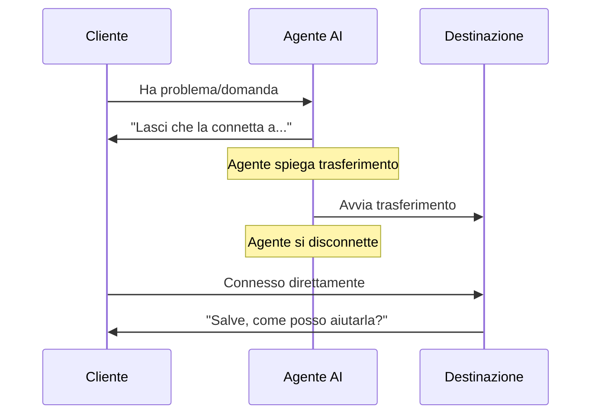

## Panoramica

L'azione Trasferimento è uno degli strumenti di controllo chiamata più potenti, consentendo ai tuoi agenti AI di instradare senza problemi le conversazioni alla destinazione giusta quando è necessario aiuto specializzato. Che si tratti di trasferire a specialisti umani, altri agenti AI o sistemi telefonici esterni, una configurazione di trasferimento adeguata assicura passaggi di consegna fluidi che mantengono la soddisfazione del cliente.

Questa guida completa copre tutto ciò che devi sapere su destinazioni di trasferimento, modalità di trasferimento, impostazioni avanzate e best practice per un instradamento chiamate affidabile.

<Note>
I trasferimenti avvengono in tempo reale durante chiamate attive. Il cliente rimane in linea mentre viene connesso alla nuova destinazione - non viene riagganciato o deve richiamare.
</Note>

---

## Destinazioni Trasferimento

itellicoAI supporta tre tipi di destinazioni di trasferimento. Scegli quello che si adatta al tuo flusso di lavoro:

<Frame>
  <div className="block dark:hidden">
    
  </div>
  <div className="hidden dark:block">
    
  </div>
</Frame>

<AccordionGroup>
  <Accordion title="Trasferimento Agente" icon="users" defaultOpen>
    Trasferisci chiamate ad altri agenti AI nel tuo account itellicoAI.

    ### Casi d'Uso

    <CardGroup cols={2}>
      <Card title="Agenti Specializzati" icon="user-gear">
        Instrada ad agenti con conoscenza specifica (fatturazione, tecnica, vendite)
      </Card>
      <Card title="Instradamento Linguistico" icon="language">
        Trasferisci ad agenti configurati per lingue diverse
      </Card>
      <Card title="Instradamento Dipartimenti" icon="sitemap">
        Dirigi ad agenti progettati per reparti specifici
      </Card>
      <Card title="Instradamento Basato su Competenze" icon="certificate">
        Connetti ad agenti con capacità specializzate
      </Card>
    </CardGroup>

    ### Configurazione

    <Steps>
      <Step title="Seleziona tipo trasferimento">
        Scegli **AGENTE** come tipo di trasferimento
      </Step>
      <Step title="Scegli agente destinazione">
        Seleziona l'agente target dal menu a tendina
      </Step>
      <Step title="Opzionale: Aggiungi musica di attesa">
        Carica audio da riprodurre durante la connessione (opzionale)
      </Step>
      <Step title="Opzionale: Aggiungi suoneria">
        Aggiungi un suono di squillo durante il trasferimento (opzionale)
      </Step>
    </Steps>

    ### Impostazioni Audio

    I trasferimenti agente supportano musica di attesa e suonerie personalizzabili:

    **Musica di Attesa:**
    - Riproduci musica mentre il cliente aspetta che il trasferimento si connetta
    - Durata: 1-30 secondi (predefinito: 6 secondi)
    - Usa per: Esperienza professionale durante ritardi di connessione
    - Non raccomandato per: Trasferimenti istantanei quando si preferisce connessione immediata

    **Durata Squillo:**
    - Riproduci suono di squillo mentre si aspetta che l'agente destinazione risponda
    - Durata: 1-30 secondi (predefinito: 4 secondi)
    - Abilitato per impostazione predefinita
    - Simula esperienza di chiamata normale

    **Impostazioni Combinate:**
    Puoi abilitare entrambe per un'esperienza di trasferimento completa:
    1. Musica si riproduce (es. 6 secondi) - Esperienza di attesa professionale
    2. Squillo si riproduce (es. 4 secondi) - Connessione in corso
    3. Agente risponde - Trasferimento completato

    **Ritardo totale:** Durata musica + Durata squillo (es. 10 secondi)

    <Info>
    Per trasferimenti agente-agente istantanei, disabilita sia musica che squillo per connessione immediata.
    </Info>

    ### Vantaggi

    - La cronologia conversazione si trasferisce con la chiamata
    - Nessun costo telefonico aggiuntivo
    - Connessione istantanea (nessun ritardo di composizione)
    - Piena conservazione del contesto
    - Musica di attesa e suoneria personalizzabili

    ### Istruzioni Esempio

    ```
    Quando un cliente segnala un problema tecnico che richiede risoluzione:
    1. Raccogli informazioni di base sul problema
    2. Spiega che lo stai connettendo a uno specialista tecnico
    3. Usa l'azione 'Trasferisci ad Agente Tecnico'
    ```
  </Accordion>

  <Accordion title="Trasferimento Numero Telefono" icon="phone">
    Trasferisci chiamate a numeri di telefono esterni - cellulari, linee fisse o numeri aziendali.

    ### Casi d'Uso

    <CardGroup cols={2}>
      <Card title="Specialisti Umani" icon="user-headset">
        Connetti ad agenti supporto dal vivo
      </Card>
      <Card title="Team di Reperibilità" icon="mobile">
        Instrada a cellulari per problemi urgenti
      </Card>
      <Card title="Reparti Esterni" icon="building">
        Trasferisci a team fuori dal tuo account
      </Card>
      <Card title="Contatti Emergenza" icon="triangle-exclamation">
        Esci da situazioni critiche
      </Card>
    </CardGroup>

    ### Configurazione

    <Steps>
      <Step title="Seleziona tipo trasferimento">
        Scegli **TELEFONO** come tipo di trasferimento
      </Step>
      <Step title="Inserisci numero telefono">
        Inserisci destinazione in formato E.164: `+1-555-123-4567`

        **Requisiti formato:**
        - Deve includere prefisso paese (+1 per US/Canada)
        - Nessuno spazio, trattino o parentesi
        - Esempi: `+14155551234`, `+442071234567`, `+61398765432`
      </Step>
    </Steps>

    ### Costi e Limitazioni

    <Warning>
    **Importante:**
    - I trasferimenti telefonici comportano costi di chiamata in uscita (le tariffe variano per destinazione)
    - **Funzionano solo durante chiamate telefoniche attive** (non chiamate web o conversazioni widget)
    - Verifica i numeri di telefono per evitare addebiti o trasferimenti falliti
    </Warning>

    ### Istruzioni Esempio

    ```
    Per problemi urgenti fuori orario lavorativo:
    1. Verifica che il problema sia veramente urgente
    2. Raccogli dettagli chiave (nome cliente, riepilogo problema)
    3. Spiega che stai connettendo al manager di reperibilità
    4. Usa l'azione 'Trasferisci a Manager di Reperibilità'
    ```
  </Accordion>

  <Accordion title="Trasferimento Indirizzo SIP" icon="network-wired">
    Trasferisci chiamate a indirizzi SIP (URI Session Initiation Protocol) per integrazione con sistemi PBX e contact center.

    ### Casi d'Uso

    <CardGroup cols={2}>
      <Card title="Integrazione PBX" icon="phone-office">
        Instrada a interni interni
      </Card>
      <Card title="Contact Center" icon="users-viewfinder">
        Trasferisci a sistemi di coda ACD
      </Card>
      <Card title="Telefonia Enterprise" icon="building-columns">
        Connetti a sistemi telefonici aziendali
      </Card>
      <Card title="Piattaforme VoIP" icon="cloud">
        Integra con infrastruttura voce
      </Card>
    </CardGroup>

    ### Configurazione

    <Steps>
      <Step title="Prerequisiti">
        Prima di configurare trasferimenti SIP:
        - Trunk SIP configurato in itellicoAI
        - Endpoint SIP destinazione raggiungibile
        - Autenticazione adeguata configurata
        - Instradamento di rete in atto
      </Step>
      <Step title="Seleziona tipo trasferimento">
        Scegli **SIP** come tipo di trasferimento
      </Step>
      <Step title="Inserisci indirizzo SIP">
        Inserisci URI SIP destinazione: `sip:1001@yourpbx.example.com`

        **Requisiti formato:**
        - Deve essere URI SIP valido
        - Includi nome utente e dominio
        - Esempi: `sip:support@pbx.company.com`, `sip:1234@10.0.1.50`
      </Step>
    </Steps>

    <Tip>
    I trasferimenti SIP sono ideali per aziende con sistemi telefonici esistenti. Forniscono integrazione senza soluzione di continuità tra agenti AI e infrastruttura telefonica tradizionale.
    </Tip>

    <Warning>
    **I trasferimenti SIP funzionano solo durante chiamate telefoniche attive.** Non possono essere utilizzati durante chiamate web o conversazioni widget.
    </Warning>

    ### Istruzioni Esempio

    ```
    Per richieste di supporto generale:
    1. Raccogli informazioni chiamante
    2. Spiega tempo di attesa stimato
    3. Usa l'azione 'Trasferisci a Coda Supporto'
    ```
  </Accordion>
</AccordionGroup>

---

## Modalità Trasferimento

### Trasferimento a Freddo (Predefinito)

L'agente trasferisce la chiamata immediatamente e si disconnette. Il cliente si connette direttamente alla destinazione senza che l'agente li presenti.

#### Come Funziona



#### Flusso Esempio

```
Cliente: "Ho una domanda sulla fatturazione"
Agente: "Sarei felice di aiutare. Lasci che la connetta al nostro reparto
        fatturazione che può accedere ai dettagli del suo account."
[Trasferimento a freddo alla fatturazione → Agente si disconnette]
Agente Fatturazione: "Salve, come posso aiutarla?"
Cliente: "Ho una domanda sulla mia fattura..."
```

#### Opzione Trasferimento Silenzioso

<Accordion title="Abilita Trasferimento Silenzioso (Opzionale)" icon="phone-slash">
  Puoi abilitare la modalità **Trasferimento Silenzioso** dove l'agente trasferisce senza dire nulla - la chiamata viene immediatamente instradata alla destinazione.

  **Come funziona:**
  1. La logica agente attiva necessità trasferimento
  2. Il trasferimento si esegue senza annuncio
  3. Cliente instradato alla destinazione silenziosamente

  **Quando usarlo:**
  - Instradamento puro, nessuna conversazione ancora (sostituzione IVR)
  - Instradamento basato su menu
  - Rilevamento lingua e auto-instradamento

  **Configurazione:**
  - Seleziona la casella **Trasferimento Silenzioso**
  - Qualsiasi messaggio di trasferimento viene ignorato quando la modalità silenziosa è abilitata

  **Esempio:**
  ```
  Agente: Router Lingua (agente instradamento silenzioso)

  Istruzioni:
  In base alla lingua parlata dal cliente:
  - Se rilevato Spagnolo, usa 'Trasferisci ad Agente Spagnolo' (silenzioso)
  - Se rilevato Francese, usa 'Trasferisci ad Agente Francese' (silenzioso)
  - Se Inglese, continua conversazione
  ```

  <Warning>
  I trasferimenti silenziosi possono sembrare bruschi ai clienti. Usa con parsimonia e solo quando appropriato per il caso d'uso.
  </Warning>
</Accordion>

### Trasferimento a Caldo

<Card title="In Arrivo Presto" icon="clock">
  **I trasferimenti a caldo** utilizzano un approccio a tre vie: il cliente sente musica di attesa mentre l'AI avvia una nuova chiamata alla destinazione in background. Una volta che la destinazione risponde, l'AI fornisce contesto (tramite messaggio sussurrato, riepilogo o introduzione a tre) prima di connettere il cliente. Questo assicura che l'agente ricevente sia informato e preparato prima di parlare con il cliente.

  **Come funziona:**

  1. Cliente messo in attesa (sente musica di attesa)
  2. AI avvia nuova chiamata a destinazione in background
  3. Destinazione risponde, AI fornisce briefing
  4. Cliente connesso ad agente destinazione informato

  **Differenza chiave dal trasferimento a freddo:** L'AI mantiene entrambe le linee di chiamata e informa la destinazione prima di connettere il cliente, piuttosto che disconnettersi immediatamente.

  Questa funzionalità è attualmente in sviluppo e sarà disponibile in una futura versione.
</Card>

---

## Supporto Multi-Destinazione

Crea azioni di trasferimento multiple per destinazioni diverse per gestire vari scenari di instradamento:

<AccordionGroup>
  <Accordion title="Configurazione Instradamento Completa" icon="sitemap">
    Configura destinazioni di trasferimento multiple per instradamento completo:

    ```text wrap
    Agente: Router Servizio Clienti

    Azioni Trasferimento Configurate:
    1. Trasferisci al Reparto Fatturazione (+1-555-100-0001)
    2. Trasferisci al Supporto Tecnico (+1-555-100-0002)
    3. Trasferisci al Team Vendite (+1-555-100-0003)
    4. Trasferisci al Reparto Resi (+1-555-100-0004)
    5. Trasferisci a Manager (sip:manager@pbx.company.com)
    6. Trasferisci ad Agente Spagnolo (ID Agente: ag_spanish_01)

    Istruzioni:
    Instrada i clienti al reparto appropriato:

    Domande fatturazione → 'Trasferisci al Reparto Fatturazione'
    Problemi tecnici → 'Trasferisci al Supporto Tecnico'
    Richieste vendite → 'Trasferisci al Team Vendite'
    Richieste reso → 'Trasferisci al Reparto Resi'
    Escalation → 'Trasferisci a Manager'
    Parlanti spagnolo → 'Trasferisci ad Agente Spagnolo'

    Spiega sempre a chi li stai connettendo prima di trasferire.
    ```
  </Accordion>

  <Accordion title="Catene Fallback" icon="arrow-turn-down-right">
    Configura opzioni di trasferimento multiple con logica fallback:

    ```text wrap
    Percorso escalation primario:
    1. Tenta 'Trasferisci al Supporto Tecnico'
    2. Se fallisce, tenta 'Trasferisci al Supporto Generale'
    3. Se fallisce, tenta 'Trasferisci a Manager'
    4. Se tutti falliscono, scusati e pianifica richiamata

    Istruzioni:
    Se il trasferimento primario fallisce, l'agente dovrebbe provare il backup,
    e gestire con grazia il fallimento completo raccogliendo info richiamata.
    ```
  </Accordion>

  <Accordion title="Instradamento Condizionale" icon="code-branch">
    Usa trasferimenti diversi in base a dati cliente o contesto conversazione:

    ```jinja
    
    Instrada clienti enterprise a 'Trasferisci a Supporto Enterprise'
    
    Instrada clienti premium a 'Trasferisci a Supporto Premium'
    
    Instrada clienti standard a 'Trasferisci a Supporto Generale'
    
    ```
  </Accordion>
</AccordionGroup>

---

## Best Practice

<AccordionGroup>
  <Accordion title="Spiega Sempre il Trasferimento" icon="comment">
    Non trasferire mai chiamate senza contesto. Spiega a chi li stai connettendo e perché.

    **Buono:**
    ```
    "Capisco che ha bisogno di aiuto con la sua fattura. Lasci che la connetta
    al nostro reparto fatturazione che può accedere al suo account e
    fare qualsiasi aggiustamento necessario. Ci vorrà solo un momento."
    ```

    **Scadente:**
    ```
    "Attenda prego." [trasferimento immediato]
    ```
  </Accordion>

  <Accordion title="Imposta Aspettative Cliente" icon="clock">
    Dì ai clienti cosa aspettarsi durante e dopo il trasferimento.

    **Buono:**
    ```
    "La sto per connettere al nostro team tecnico. Sentirà
    un breve messaggio di attesa, poi risponderanno entro 30 secondi.
    Avranno le sue informazioni pronte."
    ```

    **Scadente:**
    ```
    "Trasferisco ora." [il cliente non sa cosa sta succedendo]
    ```
  </Accordion>

  <Accordion title="Raccogli Prima le Informazioni" icon="clipboard">
    Raccogli dettagli di base prima di trasferire così il destinatario ha contesto e il cliente non deve ripetersi.

    ```
    Prima di trasferire:
    1. Ottieni nome cliente
    2. Comprendi problema di base
    3. Raccogli numero account/ordine se rilevante
    4. Chiedi sull'urgenza
    5. Poi trasferisci con contesto
    ```
  </Accordion>

  <Accordion title="Usa Nomi Descrittivi" icon="tag">
    Nomina ogni azione di trasferimento chiaramente in base alla destinazione.

    **Buono:**
    - "Trasferisci al Reparto Fatturazione"
    - "Esci al Supporto Tecnico"
    - "Instrada ad Agente Parlante Spagnolo"
    - "Connetti a Manager di Reperibilità"

    **Scadente:**
    - "Trasferimento 1"
    - "Trasferimento Telefono"
    - "Esci"
  </Accordion>

  <Accordion title="Gestisci Fallimenti Trasferimento" icon="triangle-exclamation">
    Abbi sempre un piano per quando i trasferimenti falliscono (occupato, nessuna risposta, ecc.).

    ```
    Se l'azione 'Trasferisci al Supporto' fallisce:
    1. Scusati: "Mi scusi, sto avendo problemi a connetterla in questo momento"
    2. Offri richiamata: "Posso far richiamare il nostro team supporto
       entro la prossima ora"
    3. Raccogli numero richiamata e orario migliore
    4. Conferma: "Perfetto, aspetti una chiamata da noi al [numero] entro un'ora"
    5. Usa l'azione 'Termina Chiamata Cortesemente'
    ```
  </Accordion>

  <Accordion title="Usa Formato E.164 per Numeri Telefono" icon="phone">
    Formatta sempre i numeri di telefono correttamente per evitare fallimenti trasferimento.

    **Formato E.164 corretto:**
    - Includi prefisso paese: `+1` per US/Canada
    - Nessuno spazio, trattino o parentesi
    - Esempi: `+14155551234`, `+442071234567`

    **Formati scorretti:**
    - ❌ `(415) 555-1234`
    - ❌ `415-555-1234`
    - ❌ `14155551234` (manca +)
    - ❌ `+1 415 555 1234` (spazi)
  </Accordion>

  <Accordion title="Considera Costi per Trasferimenti Telefono" icon="dollar-sign">
    Sii consapevole dei costi telefonici, specialmente per trasferimenti internazionali.

    **Ottimizzazione costi:**
    - Usa trasferimenti agente quando possibile (gratuiti)
    - Usa trasferimenti SIP per instradamento interno (tipicamente gratuiti o basso costo)
    - Limita trasferimenti telefono a escalation necessarie
    - Monitora frequenza e costi trasferimenti
    - Imposta avvisi per volumi trasferimenti inusuali
  </Accordion>

</AccordionGroup>

---

## Testare Azioni Trasferimento

Testa tutte le destinazioni di trasferimento prima di andare live per assicurare operazione affidabile:

**Test essenziali:**
- Il trasferimento si esegue e la destinazione riceve la chiamata
- La qualità audio è buona in entrambe le direzioni
- L'agente spiega il trasferimento appropriatamente nelle istruzioni
- Gli scenari di fallimento vengono gestiti con grazia (nessuna risposta, segnale occupato, destinazione non valida)
- Testa da diverse fonti di chiamata (telefono, web)

<Info>
Per trasferimenti telefono/SIP, conferma formattazione E.164 corretta e raggiungibilità destinazione.
</Info>

---

## Risoluzione Problemi

<AccordionGroup>
  <Accordion title="Trasferimento si Connette ma Cade Immediatamente" icon="phone-slash">
    **Sintomi:** Il trasferimento sembra connettersi, ma la chiamata termina subito

    **Possibili cause:**
    - Destinazione non configurata per accettare trasferimenti
    - Problema configurazione endpoint SIP
    - Agente non attivo (per trasferimenti agente)
    - Blocco rete/firewall

    **Soluzioni:**
    - Verifica che l'agente destinazione sia attivo e pubblicato
    - Testa numero telefono destinazione indipendentemente
    - Controlla configurazione trunk SIP e autenticazione
    - Rivedi regole firewall per traffico SIP
    - Controlla "Non Disturbare" o blocco chiamate su destinazione
  </Accordion>

  <Accordion title="Nessun Audio Dopo Trasferimento" icon="volume-xmark">
    **Sintomi:** Il trasferimento si connette ma nessun audio in una o entrambe le direzioni

    **Possibili cause:**
    - Porte RTP (media) bloccate
    - Problemi attraversamento NAT
    - Mancata corrispondenza codec
    - Impostazioni audio endpoint SIP

    **Soluzioni:**
    - Verifica che le porte RTP siano aperte (tipicamente 10000-20000)
    - Controlla configurazione NAT su endpoint SIP
    - Assicura codec compatibili configurati (G.711, Opus)
    - Testa audio con chiamata di test semplice prima
    - Rivedi impostazioni audio trunk SIP
  </Accordion>

  <Accordion title="Trasferimenti Telefono Falliscono con Errore" icon="circle-exclamation">
    **Sintomi:** L'azione trasferimento restituisce errore, chiamata non connessa

    **Possibili cause:**
    - Formato numero telefono non valido
    - Saldo account insufficiente
    - Numero non raggiungibile
    - Restrizioni operatore

    **Soluzioni:**
    - Verifica formato E.164: +14155551234 (non (415) 555-1234)
    - Controlla saldo account e crediti telefonici
    - Testa con numero telefono diverso
    - Verifica che paese destinazione sia supportato
    - Controlla blocco operatore o filtri spam
  </Accordion>

  <Accordion title="Trasferimenti Agente Non Preservano Contesto" icon="message-slash">
    **Sintomi:** Contesto/cronologia non disponibile ad agente ricevente

    **Possibili cause:**
    - Problema configurazione
    - Agenti in account diversi
    - Impostazione modalità trasferimento

    **Soluzioni:**
    - Verifica che entrambi gli agenti siano nello stesso account itellicoAI
    - Controlla che il trasferimento sia configurato come trasferimento agente, non telefono
    - Rivedi impostazioni trasferimento agente
    - Testa con trasferimento agente-agente semplice
    - Contatta supporto se il problema persiste
  </Accordion>

  <Accordion title="Musica di Attesa Non si Riproduce" icon="music-slash">
    **Sintomi:** Il trasferimento avviene ma nessuna musica di attesa

    **Possibili cause:**
    - Musica di attesa disabilitata nelle impostazioni
    - Durata impostata a 0
    - Trasferimento agente (musica solo per telefono/SIP)

    **Soluzioni:**
    - Abilita casella "Riproduci Musica" nelle impostazioni trasferimento
    - Imposta durata musica (raccomandati 4-8 secondi)
    - Verifica che il tipo trasferimento supporti musica (non tutti i trasferimenti agente usano musica)
    - Testa con trasferimento telefono per confermare che la musica funzioni
  </Accordion>

  <Accordion title="Suoneria Non si Riproduce" icon="bell-slash">
    **Sintomi:** Nessun suono di squillo durante il trasferimento

    **Possibili cause:**
    - Squillo disabilitato nelle impostazioni
    - Durata squillo impostata a 0
    - Trasferimento si completa prima che inizi lo squillo

    **Soluzioni:**
    - Abilita casella "Dovrebbe Squillare"
    - Imposta durata squillo (tipici 4-6 secondi)
    - Regola durata musica se lo squillo dovrebbe suonare dopo
    - Verifica che la destinazione supporti effettivamente lo squillo
  </Accordion>

  <Accordion title="Trasferimenti SIP Falliscono a Connettersi" icon="network-wired">
    **Sintomi:** I trasferimenti SIP restituiscono errori o non si connettono

    **Possibili cause:**
    - Formato URI SIP non valido
    - Trunk SIP non configurato
    - Fallimento autenticazione
    - Problema instradamento rete

    **Soluzioni:**
    - Verifica formato URI SIP: sip:user@domain.com
    - Controlla che il trunk SIP sia configurato in itellicoAI
    - Verifica che le credenziali SIP siano corrette
    - Testa endpoint SIP con client SIP
    - Controlla risoluzione DNS per dominio SIP
    - Rivedi regole firewall per traffico SIP (porta 5060/5061)
  </Accordion>

  <Accordion title="ID Chiamante Mostra Numero Sbagliato" icon="id-card">
    **Sintomi:** La chiamata trasferita mostra ID chiamante scorretto

    **Possibili cause:**
    - Passthrough ID chiamante trunk SIP non configurato
    - Impostazioni PBX che bloccano ID chiamante
    - Operatore che blocca o modifica ID chiamante

    **Soluzioni:**
    - Verifica che il tuo trunk SIP sia configurato per passare ID chiamante correttamente
    - Controlla le impostazioni ID chiamante del tuo PBX
    - Alcuni operatori bloccano passthrough ID chiamante - controlla con il tuo operatore
    - Potrebbe essere necessario configurare ID chiamanti consentiti sul tuo trunk SIP
  </Accordion>
</AccordionGroup>

---

## Esempi Mondo Reale

<AccordionGroup>
  <Accordion title="Instradamento Supporto Multi-Livello" icon="layer-group">
    Instrada problemi supporto per livello di complessità:

    ```text wrap
    Agente: Router Supporto Clienti

    Azioni Trasferimento:
    - Trasferisci a Supporto L1 (sip:support-l1@queue.company.com)
    - Trasferisci a Supporto L2 (sip:support-l2@queue.company.com)
    - Trasferisci a Ingegneria (+1-555-100-9999)

    Istruzioni:
    Instrada problemi supporto per complessità:

    Domande semplici (reset password, domande account):
    - Rispondi direttamente usando knowledge base
    - Non trasferire a meno che il cliente richieda

    Complessità media (domande funzionalità, bug minori):
    - Tenta di aiutare usando knowledge base
    - Se impossibile risolvere, usa 'Trasferisci a Supporto L1'

    Alta complessità (interruzioni sistema, bug critici):
    - Raccogli informazioni dettagliate
    - Usa 'Trasferisci a Supporto L2'

    Emergenze critiche (perdita dati, incidenti sicurezza):
    - Raccogli immediatamente tutti i dettagli
    - Usa 'Trasferisci a Ingegneria' senza ritardo
    ```
  </Accordion>

  <Accordion title="Qualificazione Vendite con Trasferimento" icon="chart-line">
    Qualifica lead e instrada al team vendite appropriato:

    ```text wrap
    Agente: Agente Qualificazione Vendite

    Azioni Trasferimento:
    - Trasferisci a Vendite Interne (+1-555-200-1000)
    - Trasferisci a Vendite Enterprise (+1-555-200-2000)
    - Trasferisci a Customer Success (sip:cs-team@company.com)

    Istruzioni:
    Per richieste vendite in entrata:

    1. Saluta e comprendi il loro interesse
    2. Poni domande qualificanti:
       - Dimensione azienda
       - Fascia budget
       - Timeline
       - Autorità decisionale

    In base alle risposte:

    Piccola impresa (<50 dipendenti, <€10k budget):
    - Fornisci risorse self-service
    - Offri di pianificare demo tramite azione prenotazione
    - Non trasferire a meno che richiedano

    Mid-market (50-500 dipendenti, €10k-€100k budget):
    - Usa 'Trasferisci a Vendite Interne'
    - Spiega: "La sto connettendo con un account executive
      che può discutere i nostri pacchetti mid-market"

    Enterprise (500+ dipendenti, €100k+ budget):
    - Usa 'Trasferisci a Vendite Enterprise'
    - Spiega: "La sto connettendo con il nostro team enterprise
      specializzato in implementazioni grandi"

    Cliente esistente che vuole espansione:
    - Usa 'Trasferisci a Customer Success'
    ```
  </Accordion>

  <Accordion title="Instradamento Fuori Orario" icon="moon">
    Gestisci chiamate fuori orario lavorativo:

    <Tip>
    **Best practice:** Se hai un sistema PBX, gestisci l'instradamento fuori orario a livello PBX per affidabilità e controllo superiori.
    </Tip>

    ```text wrap
    Agente: Supporto Fuori Orario

    Azioni Trasferimento:
    - Trasferisci a Ingegnere di Reperibilità (+1-555-emergency)
    - Trasferisci a Segreteria (sip:vm@pbx.company.com)

    Istruzioni:
    Fuori orario lavorativo normale (Lun-Ven 9-17):

    1. Saluta: "Grazie per aver chiamato. I nostri uffici sono attualmente chiusi."

    2. Chiedi dell'urgenza:
       "È un problema urgente che influenza le sue operazioni aziendali?"

    Se urgente/emergenza:
    - Raccogli dettagli: nome, azienda, descrizione problema, impatto
    - Spiega: "La sto connettendo al nostro ingegnere di reperibilità che può
      aiutare immediatamente"
    - Usa 'Trasferisci a Ingegnere di Reperibilità'

    Se non urgente:
    - Spiega orario lavorativo
    - Offri opzioni:
      a) Lascia messaggio vocale (Usa 'Trasferisci a Segreteria')
      b) Pianifica richiamata per prossimo giorno lavorativo (Usa azione prenotazione)
      c) Visita knowledge base self-service
    ```
  </Accordion>
</AccordionGroup>

---

## Configurazioni Avanzate

<AccordionGroup>
  <Accordion title="Instradamento Destinazione Dinamica" icon="globe">
    Usa variabili per determinare dinamicamente destinazioni trasferimento:

    ```jinja
    
    Destinazione trasferimento: +1-555-WEST-001
    
    Destinazione trasferimento: +1-555-EAST-001
    
    Destinazione trasferimento: +1-555-MAIN-001
    

    Quando trasferisci, usa il numero regionale appropriato.
    ```
  </Accordion>

  <Accordion title="Instradamento Basato su Tempo" icon="clock">
    Instrada trasferimenti in base all'ora del giorno:

    ```jinja
    

    
    Orario lavorativo: Usa 'Trasferisci a Team Supporto'
    
    Fuori orario: Usa 'Trasferisci a Supporto di Reperibilità'
    
    ```

    <Info>
    La variabile `current_datetime` deve essere passata al tuo agente tramite [Contesto Dinamico](/it/build/advanced/dynamic-context). Configura un endpoint contesto che restituisce questi dati nelle impostazioni operative del tuo agente.
    </Info>
  </Accordion>

  <Accordion title="Instradamento Basato su Competenze" icon="user-gear">
    Instrada in base a competenza richiesta:

    ```text wrap
    Determina competenza richiesta:
    - Domanda fatturazione → 'Trasferisci a Specialista Fatturazione'
    - Problema tecnico → 'Trasferisci a Supporto Tecnico'
    - Domanda prodotto → 'Trasferisci a Esperto Prodotto'
    - Gestione account → 'Trasferisci a Account Manager'

    Usa tipo account cliente per influenzare instradamento:
    - Account VIP ottengono sempre trasferimenti coda priorità
    - Account enterprise instradano a supporto dedicato
    - Account standard instradano a coda supporto generale
    ```
  </Accordion>
</AccordionGroup>

---

## Prossimi Passi

<CardGroup cols={2}>
  <Card title="Azioni Controllo Chiamata" icon="phone" href="/it/build/actions/call-control">
    Scopri azioni Termina Conversazione e Gestione Inattività
  </Card>
  <Card title="Panoramica Azioni" icon="bolt" href="/it/build/actions/overview">
    Comprendi tutti i tipi di azioni e quando usarli
  </Card>
  <Card title="Azioni Prenotazione" icon="calendar" href="/it/build/actions/booking-calendar">
    Configura pianificazione appuntamenti con Cal.com
  </Card>
  <Card title="Azioni API Personalizzate" icon="code" href="/it/build/actions/custom-api-actions">
    Connettiti a sistemi e API esterni
  </Card>
  <Card title="Guida Istruzioni" icon="pen" href="/it/build/conversation/instructions">
    Scrivi istruzioni efficaci per trasferimenti affidabili
  </Card>
  <Card title="Testa il Tuo Agente" icon="vial" href="/it/test/web-simulator">
    Guida test completa per agenti con trasferimenti
  </Card>
</CardGroup>
