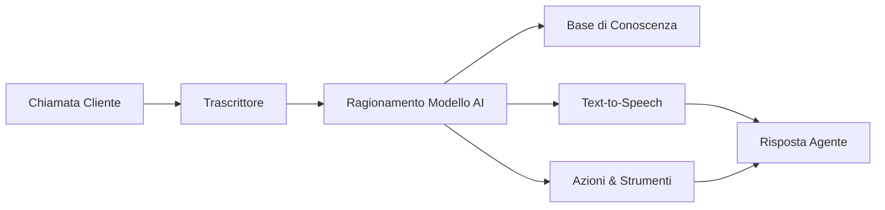

## Cos'è un Agente Vocale AI?

Un agente vocale AI è un assistente virtuale intelligente che può gestire conversazioni vocali con i tuoi clienti tramite telefono e web. A differenza dei tradizionali sistemi IVR o chatbot, gli agenti itellicoAI comprendono il linguaggio naturale, mantengono il contesto durante le conversazioni e possono eseguire azioni reali come prenotare appuntamenti, trasferire chiamate o aggiornare i tuoi sistemi.

## Capacità Principali

I tuoi agenti itellicoAI possono:

<CardGroup cols={2}>
  <Card title="Comprendere il Linguaggio Naturale" icon="brain">
    Comprendere l'intento, le domande e le richieste dei clienti in conversazioni naturali
  </Card>
  <Card title="Accedere alla Tua Conoscenza" icon="book">
    Fare riferimento alle informazioni aziendali, politiche e documentazione durante le chiamate
  </Card>
  <Card title="Eseguire Azioni" icon="bolt">
    Prenotare appuntamenti, trasferire chiamate, aggiornare sistemi e attivare flussi di lavoro
  </Card>
  <Card title="Parlare Naturalmente" icon="microphone">
    Rispondere con voci dal suono naturale in più lingue
  </Card>
</CardGroup>

## Come Funzionano gli Agenti Vocali AI

1. **Il cliente parla** - Il tuo cliente fa una domanda o una richiesta
2. **Trascrittore** - L'agente converte il parlato in testo utilizzando trascrizione avanzata
3. **Ragionamento AI** - Il modello linguistico comprende l'intento e formula una risposta
4. **Recupero conoscenza** - L'agente accede alla conoscenza aziendale quando necessario
5. **Esecuzione azione** - L'agente può attivare prenotazioni, trasferimenti o chiamate API
6. **Sintesi vocale** - La risposta viene convertita in parlato dal suono naturale
7. **L'agente risponde** - Il cliente sente una risposta utile e contestuale

## Vantaggi Chiave

<CardGroup cols={2}>
  <Card title="Disponibilità 24/7" icon="clock">
    Non dorme mai, sempre pronto ad aiutare in qualsiasi fuso orario
  </Card>

  <Card title="Qualità Costante" icon="star">
    Ogni interazione segue le tue linee guida e la voce del brand
  </Card>

  <Card title="Scalabilità Istantanea" icon="chart-line">
    Gestisci 1 chiamata o 1.000 contemporaneamente senza modifiche all'infrastruttura
  </Card>

  <Card title="Efficienza dei Costi" icon="dollar-sign">
    Riduci i costi mentre liberi il personale umano per problemi complessi
  </Card>

  <Card title="Integrazione Ricca" icon="plug">
    Connetti a CRM, calendari e strumenti aziendali per accesso dati in tempo reale
  </Card>
</CardGroup>

## Casi d'Uso Comuni

<AccordionGroup>
  <Accordion title="Assistenza Clienti" icon="headset">
    Rispondi a FAQ, risolvi problemi e inoltra casi complessi agli agenti umani
  </Accordion>

  <Accordion title="Prenotazione Appuntamenti" icon="calendar">
    Pianifica, riprogramma e invia conferme e promemoria automatizzati
  </Accordion>

  <Accordion title="Qualificazione Lead" icon="user-plus">
    Coinvolgi potenziali clienti, raccogli informazioni e indirizza lead qualificati alle vendite
  </Accordion>

  <Accordion title="Stato Ordine e Tracciamento" icon="box">
    Controlla lo stato dell'ordine e fornisci aggiornamenti di tracciamento
  </Accordion>

  <Accordion title="Pagamento e Fatturazione" icon="credit-card">
    Rispondi a domande di fatturazione, elabora pagamenti e invia promemoria
  </Accordion>

  <Accordion title="Raccolta Feedback" icon="comment">
    Conduci sondaggi e raccogli feedback dei clienti su larga scala
  </Accordion>
</AccordionGroup>

## Prossimi Passi

Pronto a creare il tuo primo agente? Continua con:

<CardGroup cols={2}>
  <Card title="Crea il Tuo Primo Agente" icon="plus" href="/it/build/getting-started/create-first-agent">
    Guida passo-passo per creare il tuo primo agente vocale AI
  </Card>
  <Card title="Tipi di Agenti e Casi d'Uso" icon="list" href="/it/build/getting-started/agent-use-cases">
    Comprendi i diversi tipi di agenti e quando usare ciascuno
  </Card>
</CardGroup>
