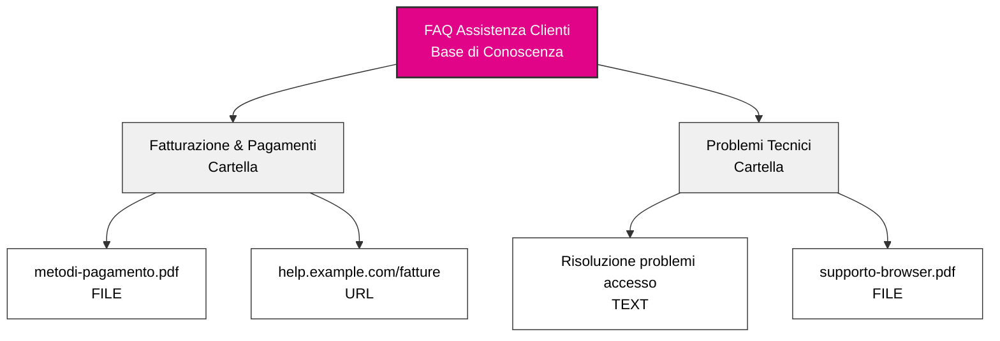
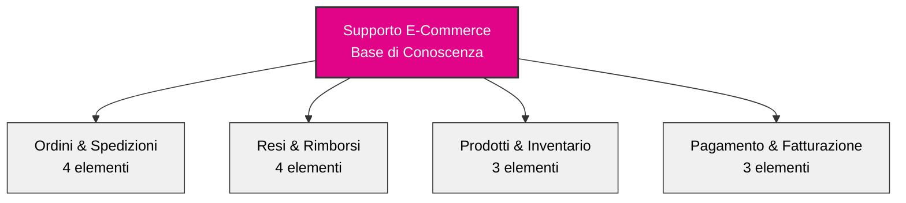

## Panoramica

Le basi di conoscenza trasformano il tuo agente AI da un assistente generico in un esperto aziendale. Organizzando le informazioni della tua azienda in una gerarchia strutturata, il tuo agente può accedere istantaneamente e fare riferimento a politiche, procedure, dettagli sui prodotti e qualsiasi altra informazione su cui si basa la tua attività.

Pensa alle basi di conoscenza come armadi intelligenti che il tuo agente può consultare in millisecondi durante le conversazioni.

## Architettura della Conoscenza

### La Gerarchia a Tre Livelli

La conoscenza in itellicoAI segue una struttura semplice e intuitiva:

**Base di Conoscenza → Cartelle → Elementi**

Gli elementi possono essere **testo**, **file** (PDF, Word, Markdown, CSV, JSON, YAML, XML, ecc.), o **URL** (solo singola pagina web - non interi siti web).

Questa gerarchia facilita l'organizzazione di grandi quantità di informazioni mantenendole accessibili e gestibili.

---

## Panoramica del Dashboard

### Interfaccia Principale della Conoscenza

Naviga su **Conoscenza** nella barra laterale sinistra per accedere al tuo dashboard di gestione della conoscenza con una vista a colpo d'occhio di tutte le tue basi di conoscenza:

<CardGroup cols={1}>
  <Card title="FAQ Assistenza Clienti">
    - 127 elementi
    - Aggiornata Oggi
  </Card>
  <Card title="Documentazione Prodotto">
    - 89 elementi
    - Aggiornata Ieri
  </Card>
  <Card title="Politiche Aziendali">
    - 45 elementi
    - Aggiornata 3 giorni fa
  </Card>
</CardGroup>

Ogni scheda della base di conoscenza mostra:
- Numero totale di elementi in tutte le cartelle
- Timestamp dell'ultimo aggiornamento
- Azioni: Copia segnaposto di riferimento, Modifica, Elimina

---

## Comprensione di Ogni Livello

### Basi di Conoscenza

<Card title="Cos'è una Base di Conoscenza?" icon="database">
  Una base di conoscenza è il contenitore di livello superiore che raggruppa informazioni correlate. Rappresenta una categoria principale o un dominio della conoscenza aziendale.
</Card>

**Pensa alle basi di conoscenza come diversi schedari nel tuo ufficio:**
- Uno schedario per i materiali di assistenza clienti
- Un altro per la documentazione del prodotto
- Un altro per le politiche aziendali
- Un altro per le risorse di vendita

**Esempi di basi di conoscenza:**
- **FAQ Assistenza Clienti** - Tutte le informazioni di supporto rivolte ai clienti
- **Documentazione Prodotto** - Documentazione tecnica, guide utente, descrizioni delle funzionalità
- **Politiche Aziendali** - Politiche HR, documenti di conformità, procedure interne
- **Risorse di Vendita** - Listini prezzi, confronti con la concorrenza, presentazioni

### Cartelle

<Card title="Cos'è una Cartella?" icon="folder">
  Le cartelle sono unità organizzative all'interno di una base di conoscenza. Raggruppano elementi correlati per argomento, categoria o scopo.
</Card>

**Pensa alle cartelle all'interno del tuo schedario:**
- Organizzano contenuti simili insieme
- Rendono le informazioni più facili da trovare e gestire
- Ti permettono di assegnare argomenti specifici agli agenti

**Esempi di cartelle all'interno di una base di conoscenza Assistenza Clienti:**
- **Fatturazione & Pagamenti** - Domande sulle fatture, metodi di pagamento, rimborsi
- **Problemi Tecnici** - Guide di risoluzione problemi, messaggi di errore, soluzioni ai bug
- **Informazioni Prodotto** - Funzionalità, specifiche, compatibilità
- **Politiche di Reso** - Tempi di reso, condizioni, passaggi del processo

<Tip>
Usa nomi di cartelle chiari e descrittivi. Sia il tuo team che la tua AI beneficeranno di un'organizzazione intuitiva.
</Tip>

### Elementi di Conoscenza

<Card title="Cos'è un Elemento di Conoscenza?" icon="file">
  Gli elementi di conoscenza sono le informazioni vere e proprie - documenti, FAQ, politiche, procedure o qualsiasi contenuto che vuoi che il tuo agente conosca.
</Card>

**Gli elementi di conoscenza possono essere:**
- **Voci di testo** - Contenuto scritto direttamente
- **Caricamenti di file** - PDF, Word (.doc, .docx), Testo (.txt, .log), Markdown (.md), CSV/TSV, JSON, YAML, XML (fino a 10MB)
- **Scraping di URL** - Contenuto da una singola pagina web (non interi siti web)

**Esempi di elementi di conoscenza:**
- "Politica di Rimborso per Prodotti Digitali"
- "Come Reimpostare la Password - Passo dopo Passo"
- "Specifiche Prodotto - Modello X200"
- "Tempi di Spedizione per Regione"

Ogni elemento di conoscenza include:
- **Titolo** - Nome descrittivo del contenuto
- **Contenuto/Fonte** - Le informazioni effettive (testo, file o URL)
- **Stato Elaborazione Contenuto** - Stato dell'estrazione (In Sospeso, In Elaborazione, Completato, Fallito)
- **Stato Indicizzazione Vettoriale** - Stato preparazione RAG (In Sospeso, In Indicizzazione, Indicizzato, Fallito)
- **Metadati** - Data di creazione, ultimo aggiornamento, dimensione del contenuto, conteggio token

---

## Quando Usare le Basi di Conoscenza

<AccordionGroup>
  <Accordion title="Il tuo agente deve rispondere a domande specifiche" icon="circle-question">
    Se i clienti chiedono regolarmente informazioni su politiche, procedure o dettagli del prodotto, aggiungi tali informazioni a una base di conoscenza. Il tuo agente le riferirà con precisione ogni volta.

    **Esempio:** Il cliente chiede "Qual è la vostra politica di reso?" L'agente recupera l'esatta politica dalla tua base di conoscenza e la spiega in modo naturale.
  </Accordion>

  <Accordion title="Hai documentazione dettagliata" icon="book">
    Se hai documentazione esistente - manuali utente, FAQ, documenti di politica - puoi caricarli direttamente in vari formati (PDF, DOC, DOCX, TXT). Il tuo agente sarà in grado di cercarli e fare riferimento a essi nelle conversazioni.

    **Esempio:** Carica il tuo manuale del prodotto di 50 pagine. Quando i clienti hanno domande tecniche, il tuo agente trova e spiega le sezioni pertinenti.
  </Accordion>

  <Accordion title="Le informazioni cambiano frequentemente" icon="arrows-rotate">
    Le basi di conoscenza rendono facile aggiornare le informazioni senza modificare le istruzioni principali del tuo agente. Aggiorna un listino prezzi o un documento di politica, e il tuo agente ha immediatamente le nuove informazioni.

    **Esempio:** Aggiorni il tuo documento sui prezzi una volta, e tutti gli agenti che usano quella base di conoscenza fanno immediatamente riferimento ai nuovi prezzi.
  </Accordion>

  <Accordion title="Più agenti necessitano delle stesse informazioni" icon="users">
    Crea una base di conoscenza e condividila tra più agenti. Mantieni le informazioni in un unico posto, usale ovunque.

    **Esempio:** La tua base di conoscenza "Specifiche Prodotto" può essere utilizzata dal tuo agente di vendita, agente di supporto e agente di qualificazione pre-vendita.
  </Accordion>

  <Accordion title="Vuoi separare le responsabilità" icon="layer-group">
    Mantieni le istruzioni conversazionali del tuo agente separate dalle informazioni fattuali. Le istruzioni definiscono personalità e comportamento; le basi di conoscenza forniscono fatti e dettagli.

    **Esempio:** Le istruzioni del tuo agente dicono "sii amichevole e professionale." La tua base di conoscenza contiene le specifiche effettive del prodotto, i prezzi e le politiche.
  </Accordion>
</AccordionGroup>

---

## Best Practice di Organizzazione

### Inizia con Categorie Chiare

<CardGroup cols={2}>
  <Card title="Per Dipartimento" icon="building">
    - Conoscenza Vendite
    - Conoscenza Supporto
    - Conoscenza Fatturazione
    - Documentazione Tecnica
  </Card>
  <Card title="Per Argomento" icon="tags">
    - Informazioni Prodotto
    - Politiche & Procedure
    - Risoluzione Problemi
    - FAQ
  </Card>
  <Card title="Per Percorso Cliente" icon="map">
    - Informazioni Pre-Vendita
    - Guide di Onboarding
    - Utilizzo & Funzionalità
    - Supporto & Risoluzione Problemi
  </Card>
  <Card title="Per Pubblico" icon="user-group">
    - Informazioni Rivolte ai Clienti
    - Procedure Interne
    - Risorse Partner
    - Specifiche Tecniche
  </Card>
</CardGroup>

### Convenzioni di Denominazione

Usa nomi chiari e coerenti che abbiano senso per tutto il tuo team:

**Buoni esempi di denominazione:**
- Base di Conoscenza: "Risorse Assistenza Clienti"
- Cartella: "Fatturazione & Pagamenti"
- Elemento: "Politica di Rimborso - Prodotti Digitali"

**Cattivi esempi di denominazione:**
- Base di Conoscenza: "KB_001"
- Cartella: "Vari Documenti"
- Elemento: "Politica_v2_finale_AGGIORNATO"

<Tip>
Includi date o numeri di versione nei titoli degli elementi se mantieni più versioni: "Listino Prezzi - Q1 2025"
</Tip>

### Esempio di Base di Conoscenza Ben Strutturata

Ecco un esempio di una base di conoscenza e-commerce ben organizzata:

**Contenuto delle cartelle:**
- **Ordini & Spedizioni:** Tracciamento, tempi di spedizione, info internazionali, modifiche
- **Resi & Rimborsi:** Politica, processo di spedizione, tempi di elaborazione, cambi
- **Prodotti & Inventario:** Categorie, disponibilità scorte, specifiche
- **Pagamento & Fatturazione:** Metodi di pagamento, fatture, piani di pagamento

**Cosa rende buona questa struttura:**
- Nomi di cartelle chiari e descrittivi che raggruppano contenuti correlati
- Distribuzione equilibrata (3-4 elementi per cartella)
- Facile da navigare e trovare informazioni
- Si adatta bene man mano che aggiungi più contenuti

### Estrai Solo Contenuto Rilevante

<Warning>
**Più conoscenza ≠ Migliori prestazioni**

Aggiungere troppa conoscenza aumenta la possibilità che il tuo agente recuperi informazioni irrilevanti insieme a ciò che è effettivamente necessario.
</Warning>

**Best practice per documenti di grandi dimensioni:**

Invece di caricare interi manuali o documenti di politica, estrai solo le pagine/sezioni di cui il tuo agente ha bisogno.

<AccordionGroup>
  <Accordion title="❌ Evita: Caricare l'intero manuale del dipendente di 200 pagine" icon="xmark">
    **Problema:**
    - L'agente trova e mescola sezioni irrilevanti con la risposta corretta
    - Più difficile per l'agente determinare cosa è effettivamente rilevante
    - Spreca spazio di conversazione su contenuti non correlati

    **Esempio:**
    Il cliente chiede: "Qual è la vostra politica di reso?"

    L'agente potrebbe includere: politiche di ferie HR, procedure interne, benefit dei dipendenti — e avere difficoltà a separare ciò di cui il cliente ha effettivamente bisogno.
  </Accordion>

  <Accordion title="✅ Meglio: Estrai sezioni specifiche" icon="check">
    **Approccio:**
    - "Politica di Reso - Pagine 45-48"
    - "Politica di Spedizione - Pagine 52-55"
    - "Termini di Garanzia - Pagine 89-92"

    **Beneficio:**
    - L'agente trova solo contenuto rilevante per i clienti
    - Risposte più chiare e accurate
    - Uso più efficiente dello spazio di conversazione

    **Esempio:**
    Il cliente chiede: "Qual è la vostra politica di reso?"

    L'agente recupera: Solo la sezione della politica di reso di 4 pagine — esattamente ciò che serve, nient'altro.
  </Accordion>
</AccordionGroup>

**Come estrarre sezioni rilevanti:**
- Esporta pagine specifiche da PDF come file separati
- Copia sezioni rilevanti in elementi TEXT
- Collega a URL specifici ancorati invece di interi siti di documentazione

### Manutenzione Regolare

<Steps>
  <Step title="Revisione trimestrale">
    Pianifica revisioni regolari delle tue basi di conoscenza per garantire che le informazioni rimangano aggiornate.
  </Step>
  <Step title="Rimuovi contenuto obsoleto">
    Elimina elementi che non sono più rilevanti o scollegali dagli agenti. Le informazioni obsolete possono confondere il tuo agente e fornire risposte errate.
  </Step>
  <Step title="Aggiorna in base al feedback">
    Se i clienti segnalano informazioni errate, controlla immediatamente la tua base di conoscenza.
  </Step>
</Steps>

---

## Esempi dal Mondo Reale

<AccordionGroup>
  <Accordion title="Agente di Supporto SaaS" icon="headset">
    **Base di Conoscenza:** "Supporto Prodotto SaaS"

    **Cartelle:**
    - **Gestione Account** (15 elementi)
      - Processo di reimpostazione password
      - Istruzioni di upgrade account
      - Informazioni sul ciclo di fatturazione
      - Tabella di confronto piani
    - **Documentazione Funzionalità** (47 elementi)
      - Guide alle singole funzionalità
      - Tutorial di integrazione
      - Documentazione API
      - Best practice
    - **Risoluzione Problemi** (23 elementi)
      - Messaggi di errore comuni
      - Problemi di connessione
      - Compatibilità browser
      - Ottimizzazione prestazioni

    **Risultato:** L'agente di supporto può rispondere all'80% delle domande tecniche senza intervento umano.
  </Accordion>

  <Accordion title="Agente Appuntamenti Sanitari" icon="calendar">
    **Base di Conoscenza:** "Servizi ai Pazienti"

    **Cartelle:**
    - **Politiche Appuntamenti** (8 elementi)
      - Linee guida per la programmazione
      - Politica di cancellazione
      - Requisiti assicurativi
      - Processo nuovi pazienti
    - **Informazioni Ufficio** (5 elementi)
      - Sedi e orari dell'ufficio
      - Istruzioni per il parcheggio
      - Informazioni sull'accessibilità
      - Elenco contatti
    - **Assicurazione & Fatturazione** (12 elementi)
      - Fornitori assicurativi accettati
      - Opzioni di pagamento
      - Domande sulla fatturazione
      - Assistenza finanziaria

    **Risultato:** L'agente gestisce la prenotazione di appuntamenti e domande sulle politiche 24/7 con completa accuratezza.
  </Accordion>

  <Accordion title="Agente Vendite E-Commerce" icon="shopping-cart">
    **Base di Conoscenza:** "Catalogo Prodotti & Vendite"

    **Cartelle:**
    - **Specifiche Prodotto** (89 elementi)
      - Descrizioni dettagliate del prodotto
      - Specifiche tecniche
      - Informazioni sulla compatibilità
      - Guide alle taglie
    - **Prezzi & Promozioni** (15 elementi)
      - Prezzi attuali
      - Promozioni attive
      - Sconti per quantità
      - Vendite stagionali
    - **Spedizione & Consegna** (7 elementi)
      - Opzioni di spedizione
      - Tempi di consegna
      - Spedizione internazionale
      - Informazioni sul tracciamento

    **Risultato:** L'agente di vendita fornisce istantaneamente informazioni accurate su prodotti e prezzi durante le conversazioni con i clienti.
  </Accordion>
</AccordionGroup>

---

## Prossimi Passi

<CardGroup cols={2}>
  <Card title="Crea Basi di Conoscenza" icon="plus" href="/it/build/knowledge/create-knowledge-bases">
    Guida passo-passo per creare e organizzare la tua conoscenza
  </Card>
  <Card title="Tipi di Contenuto" icon="file-lines" href="/it/build/knowledge/content-types">
    Scopri gli elementi di conoscenza di tipo testo, file e URL
  </Card>
  <Card title="Assegna agli Agenti" icon="link" href="/it/build/knowledge/assign-knowledge">
    Collega le basi di conoscenza ai tuoi agenti
  </Card>
  <Card title="Context vs RAG" icon="brain" href="/it/build/knowledge/context-vs-rag">
    Scegli il metodo di accesso giusto per il tuo caso d'uso
  </Card>
</CardGroup>
