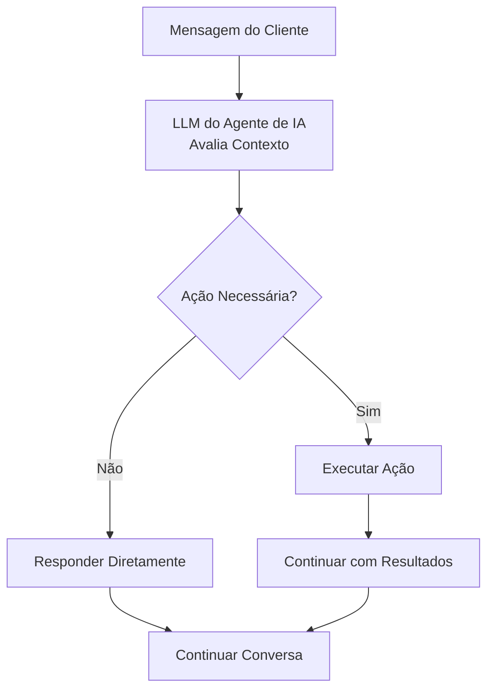

## Visão Geral

Ações transformam seus agentes de IA de assistentes apenas de conversa em poderosas ferramentas de automação de negócios. Além de responder perguntas, seus agentes podem agendar compromissos, transferir chamadas, atualizar sistemas e integrar com seus fluxos de trabalho de negócios existentes - tudo isso mantendo o fluxo natural da conversa.

Pense nas ações como o kit de ferramentas do seu agente. Assim como um funcionário humano usa diferentes ferramentas para completar tarefas, seu agente de IA executa ações para realizar trabalho real durante interações com clientes.

<Note>
Ações são executadas automaticamente com base no contexto da conversa e nas instruções que você fornece no prompt do seu agente. Você define quando e como as ações devem ser usadas através da [engenharia de prompt](/pt/build/conversation/prompt-engineering-guide).
</Note>

---

## O Que São Ações?

Ações são ferramentas pré-configuradas que seu agente pode invocar durante conversas para realizar tarefas específicas. Quando um cliente solicita algo que requer ação - como agendar um compromisso ou falar com um especialista - seu agente pode executar a ação apropriada perfeitamente.

### Como as Ações Funcionam

Durante conversas, seu agente decide autonomamente se deve responder diretamente ou executar uma ação:



O agente usa **nomes e descrições de ações** para entender o que cada ação faz. Estes são cruciais para ajudar o LLM a selecionar a ferramenta certa.

**Melhores práticas:**
- Dê às ações nomes claros e descritivos (ex: "agendar_compromisso" não "acao1")
- Escreva descrições detalhadas explicando o que a ação faz
- Adicione instruções explícitas nas [instruções do agente (prompt do sistema)](/pt/build/conversation/prompt-engineering-guide) sobre **quando** usar cada ação

<Note>
Enquanto nomes e descrições de ações dizem ao agente **o que** uma ação faz, suas instruções do agente (prompt do sistema) devem especificar **quando** usá-la. Por exemplo: "Quando um cliente pedir para falar com um humano, use a ação transferir_para_suporte."
</Note>

---

## Categorias de Ações

Ações são organizadas em duas categorias no painel:

### Controle de Chamadas

<CardGroup cols={2}>
  <Card title="Transferir Chamada" icon="phone" href="/pt/build/actions/transfer-details">
    Transferir para outro agente de IA, número de telefone ou endereço SIP
  </Card>
  <Card title="Encerrar Conversa" icon="phone-slash" href="/pt/build/actions/call-control">
    Fazer o agente encerrar a conversa com uma mensagem personalizada
  </Card>
</CardGroup>

### Integração

<CardGroup cols={2}>
  <Card title="Ação Personalizada" icon="code" href="/pt/build/actions/custom-api-actions">
    Criar uma ação de API ou webhook personalizada
  </Card>
  <Card title="Agendamento de Calendário" icon="calendar" href="/pt/build/actions/booking-calendar">
    Agendar compromissos usando integração com Cal.com
  </Card>
</CardGroup>

---

## Quando as Ações São Executadas

Ações são executadas **durante a conversa** quando acionadas pelo seu agente com base em suas instruções. Ao contrário de sistemas IVR tradicionais que seguem scripts rígidos, agentes de IA usam compreensão contextual para determinar quando ações são apropriadas.

### Mecanismos de Acionamento

**Acionadores Baseados em Instruções:**
```text wrap
Quando o cliente pedir para falar com um humano, use a ação 'Transferir para Suporte'.

Após agendar com sucesso um compromisso, use a ação 'Encerrar Chamada Educadamente'.

Se o cliente disser que precisa de tempo para verificar algo, use a ação 'Pausar Timer de Inatividade'.
```

**Acionadores Condicionais:**
```jinja
Se o cliente relatar um problema de cobrança:
1. Use a ação 'Buscar Conta' para recuperar suas informações
2. Se o saldo estiver vencido, transfira para o departamento de cobrança
3. Se o saldo estiver em dia, solucione o problema


Sempre ofereça transferir clientes VIP para suporte dedicado imediatamente.

```

**Fluxos de Trabalho Multi-Etapas:**
```text wrap
Fluxo de Agendamento de Compromisso:
1. Coletar informações necessárias (nome, email, data preferida)
2. Usar ação 'Verificar Disponibilidade' para consultar Cal.com
3. Apresentar opções ao cliente
4. Usar ação 'Agendar Compromisso' para confirmar
5. Usar ação 'Enviar Confirmação por SMS' se o cliente forneceu telefone
6. Usar ação 'Encerrar Chamada Educadamente' para concluir
```

<Warning>
Ações são executadas em tempo real durante a chamada. Certifique-se de que seus endpoints são confiáveis e respondem rapidamente para evitar pausas constrangedoras na conversa.
</Warning>

---

## Configurando Ações

Toda configuração de ação acontece no editor de agentes na aba **Habilidades → Ações**.

<Steps>
  <Step title="Navegue até Ações">
    Abra seu agente no editor e clique na aba **Habilidades** → **Ações**
  </Step>
  <Step title="Escolha o Tipo de Ação">
    Navegue pelas categorias **Controle de Chamadas** e **Integração** e clique em **Adicionar** na ação que deseja configurar
  </Step>
  <Step title="Configure a Ação">
    Preencha o formulário de configuração específico da ação:
    - **Nome**: Dê à sua ação um nome claro e descritivo
    - **Descrição**: Explique o que esta ação faz
    - **Configurações específicas da ação**: Configure parâmetros com base no tipo de ação
  </Step>
  <Step title="Salvar">
    Salve a ação para adicioná-la ao kit de ferramentas do seu agente
  </Step>
</Steps>

---

## Indicadores de Status de Ação

Após adicionar ações, você as verá listadas na aba Ações do seu agente com indicadores de status:

<CardGroup cols={3}>
  <Card title="Configurada" icon="circle-check">
    Ação está configurada corretamente e pronta para uso
  </Card>
  <Card title="Incompleta" icon="circle-exclamation">
    Faltando configuração ou credenciais obrigatórias
  </Card>
  <Card title="Erro" icon="circle-xmark">
    Erro de configuração ou falha de autenticação
  </Card>
</CardGroup>

---

## Referenciando Ações nas Instruções

Para usar ações, referencie-as **pelo nome exato** nas instruções do seu agente:

### Referência Direta
```text wrap
Quando um cliente pedir para falar com alguém sobre cobrança,
use a ação 'Transferir para Departamento de Cobrança'.
```

### Com Condições
```text wrap
Se o problema do cliente não puder ser resolvido:
1. Peça desculpas pelo inconveniente
2. Explique que você está conectando-os a um especialista
3. Use a ação 'Transferir para Suporte'
```

### Com Parâmetros
```text wrap
Após coletar o email do cliente e a data preferida,
use a ação 'Agendar Consulta' para marcar a reunião.
```

<Note>
Nomes de ações são sensíveis a maiúsculas e minúsculas e devem corresponder exatamente como configurado. Se você renomear uma ação, atualize todas as referências em suas instruções.
</Note>

---

## Melhores Práticas de Configuração

<AccordionGroup>
  <Accordion title="Comece Simples" icon="seedling">
    Comece com ações básicas antes de adicionar integrações complexas. Adicione uma ação por vez, teste completamente, depois adicione a próxima.

    **Exemplo de progressão:**
    1. Adicionar ação Encerrar Conversa
    2. Adicionar ação Transferir para Suporte
    3. Adicionar ação de Agendamento
    4. Adicionar ações de API Personalizadas
  </Accordion>

  <Accordion title="Use Nomes Claros e Descritivos" icon="tag">
    Nomes de ações são críticos - o LLM os usa para entender o que cada ferramenta faz. Use nomes descritivos e orientados à ação que transmitam claramente o propósito da função.

    **Por que isso importa:** O modelo depende de nomes e descrições de funções para detectar quando uma função precisa ser chamada e escolher a ferramenta certa para a tarefa.

    **Bons nomes:**
    - "Obter Conta do Cliente" - Verbo de ação claro + alvo específico
    - "Transferir para Departamento de Cobrança" - Destino específico incluído
    - "Agendar Consulta de 30 Minutos" - Inclui detalhes relevantes

    **Nomes ruins:**
    - "Ação 1" - Sem contexto sobre o que faz
    - "Transferir" - Muito genérico, destino pouco claro
    - "Chamada de API" - Não descreve a ação
  </Accordion>

  <Accordion title="Escreva Descrições Detalhadas" icon="file-lines">
    Descrições de ações ajudam o LLM a entender **o que** a ação faz. A descrição deve explicar o propósito da ação, o que ela retorna e quais parâmetros ela usa.

    **Melhores práticas de [chamada de função OpenAI](https://platform.openai.com/docs/guides/function-calling):**
    - Descreva claramente o que a ação faz e o que ela retorna
    - Explique quais parâmetros ou dados ela usa
    - Use linguagem precisa que guie a compreensão do modelo
    - Mantenha conciso mas abrangente

    **Exemplo:**
    ```
    Nome: Obter Conta do Cliente
    Descrição: Recupera dados da conta do cliente do Salesforce CRM usando
    o número de telefone. Retorna status da conta, saldo e pedidos recentes.
    ```

    **Nota:** Descreva **o que** a ação faz na descrição. Especifique **quando** usá-la nas [instruções do agente (prompt do sistema)](/pt/build/conversation/prompt-engineering-guide).
  </Accordion>

  <Accordion title="Teste Completamente" icon="vial">
    Teste cada ação na interface de teste do agente antes de colocar no ar:
    - Verifique se a ação executa corretamente
    - Teste cenários de sucesso
    - Teste cenários de falha
    - Verifique tratamento de erros
    - Verifique fluxo da conversa
  </Accordion>

  <Accordion title="Trate Falhas com Elegância" icon="shield-check">
    Configure comportamentos de fallback para quando ações falham. Instrua seu agente o que fazer quando ações não funcionam.

    ```
    Se a ação 'Agendar Compromisso' falhar:
    1. Peça desculpas sinceramente
    2. Ofereça que alguém ligará de volta para agendar
    3. Colete o número preferido para retorno
    4. Use a ação 'Encerrar Chamada Educadamente'
    ```
  </Accordion>

  <Accordion title="Colete Informações Primeiro" icon="clipboard-check">
    Certifique-se de que os agentes coletam dados necessários antes de executar ações. Não tente agendar compromissos sem endereços de email ou transferir chamadas sem explicar por quê.

    ```
    Antes de usar a ação 'Agendar Consulta':
    1. Confirme que o cliente quer agendar
    2. Pergunte o endereço de email se não estiver no registro de contato
    3. Discuta suas datas e horários preferidos
    4. Explique o que a consulta cobrirá
    5. Só então execute a ação de agendamento
    ```
  </Accordion>

  <Accordion title="Proteja Credenciais" icon="lock">
    Use autenticação apropriada para todas as ações personalizadas. Nunca exponha chaves de API ou credenciais em URLs ou campos não criptografados.

    - Use tokens Bearer para autenticação de API
    - Use autenticação básica apenas sobre HTTPS
    - Armazene credenciais sensíveis com segurança
    - Rotacione credenciais regularmente
  </Accordion>
</AccordionGroup>

---

## Testando Ações

Antes de implantar agentes com ações, teste completamente na interface de teste do painel:

<Steps>
  <Step title="Abra a Interface de Teste">
    Clique em **Testar Chamada** no canto superior direito do editor de agentes
  </Step>
  <Step title="Inicie Chamada Web">
    Clique em **Iniciar Chamada Web** para começar uma conversa de teste
  </Step>
  <Step title="Acione Cada Ação">
    Execute cenários que acionam cada ação configurada
  </Step>
  <Step title="Verifique Execução">
    Verifique se as ações executam corretamente e lidam com respostas apropriadamente
  </Step>
  <Step title="Teste Casos de Falha">
    Simule falhas para verificar se o tratamento de erros funciona como esperado
  </Step>
  <Step title="Revise a Transcrição">
    Examine a transcrição da conversa para garantir que o fluxo é natural e as ações se integram suavemente
  </Step>
</Steps>

### O Que Testar

**Para Ações de Transferência:**
- Transferência executa para o destino correto
- Música de espera toca se configurada
- Mensagem de transferência é apropriada
- Modos de transferência fria vs quente funcionam corretamente

**Para Ações de Agendamento:**
- Disponibilidade é recuperada corretamente
- Agendamento confirma com sucesso
- Notificações por email/SMS são enviadas corretamente
- Tratamento de fuso horário é preciso

**Para Ações Personalizadas:**
- Chamadas de API são bem-sucedidas
- Autenticação funciona
- Dados de resposta estão disponíveis para o agente
- Respostas de erro são tratadas com elegância

**Para Todas as Ações:**
- Agente referencia ação pelo nome correto
- Agente coleta informações necessárias primeiro
- Fluxo da conversa permanece natural
- Falhas não quebram a conversa

<Warning>
Chamadas de teste usam integrações reais. Se você está testando uma ação de agendamento, ela criará compromissos reais na sua conta Cal.com. Limpe dados de teste depois.
</Warning>

---

## Casos de Uso Comuns

### Fluxo de Trabalho de Suporte ao Cliente

```text wrap
Configuração do Agente:
- Transferir para Suporte (para problemas complexos)
- Buscar Conta do Cliente (API personalizada)
- Criar Ticket de Suporte (API personalizada)
- Encerrar Chamada Educadamente

Instruções:
Quando um cliente ligar:
1. Cumprimente-os calorosamente
2. Use 'Buscar Conta do Cliente' para recuperar suas informações
3. Pergunte sobre o problema
4. Se você pode resolver, faça usando a base de conhecimento
5. Se for complexo, use 'Criar Ticket de Suporte' e forneça número do ticket
6. Se o cliente solicitar humano, use 'Transferir para Suporte'
7. Quando resolvido, use 'Encerrar Chamada Educadamente'
```

### Fluxo de Trabalho de Agendamento de Compromisso

```text wrap
Configuração do Agente:
- Agendar Consulta (agendamento Cal.com)
- Enviar Confirmação por SMS (opcional)
- Transferir para Agendamento (fallback)
- Encerrar Chamada Educadamente

Instruções:
Quando um cliente quiser agendar:
1. Pergunte que tipo de compromisso eles precisam
2. Colete endereço de email se não estiver no registro de contato
3. Discuta suas datas preferidas
4. Use 'Agendar Consulta' para mostrar disponibilidade e confirmar
5. Se agendamento for bem-sucedido, confirme detalhes verbalmente
6. Se agendamento falhar, use 'Transferir para Agendamento'
7. Use 'Encerrar Chamada Educadamente' para finalizar
```

### Fluxo de Trabalho de Qualificação de Vendas

```text wrap
Configuração do Agente:
- Buscar Dados da Empresa (API personalizada)
- Atualizar Lead CRM (API personalizada)
- Transferir para Vendas (para leads qualificados)
- Encerrar Chamada Educadamente

Instruções:
Para chamadas de vendas de saída:
1. Apresente-se e o propósito
2. Use 'Buscar Dados da Empresa' para recuperar firmográficos
3. Faça perguntas qualificadoras (orçamento, cronograma, autoridade)
4. Use 'Atualizar Lead CRM' com status de qualificação
5. Se qualificado, use 'Transferir para Vendas' com contexto
6. Se não qualificado, agradeça e use 'Encerrar Chamada Educadamente'
```

---

## Solucionando Problemas Comuns

<AccordionGroup>
  <Accordion title="Ação Não Está Acionando" icon="circle-exclamation">
    **Problema:** Agente não usa a ação mesmo quando deveria.

    **Soluções:**
    - Verifique se o nome da ação nas instruções corresponde exatamente (sensível a maiúsculas)
    - Verifique se o status da ação é "Configurada" não "Incompleta" ou "Erro"
    - Torne as instruções mais explícitas sobre quando usar a ação
    - Teste isoladamente pedindo explicitamente ao agente para usar a ação
    - Revise a transcrição da conversa para ver o raciocínio do agente
  </Accordion>

  <Accordion title="Agente Diz Que Executará Ação Mas Não Executa" icon="comments">
    **Problema:** Agente confirma verbalmente que está executando uma ação (ex: "Estou transferindo você agora") mas a ação não executa até o próximo turno da conversa.

    **Por que isso acontece:** O agente gera uma resposta e executa a ação no mesmo turno, mas apenas um pode acontecer por turno.

    **Solução:** Instrua o agente a pedir confirmação do usuário antes de executar ações:

    ```jinja
    Antes de usar a ação 'Transferir para Suporte':
    1. Explique por que você está transferindo-os
    2. Pergunte "Gostaria que eu transferisse você agora?"
    3. Aguarde confirmação
    4. Uma vez confirmado, execute a ação 'Transferir para Suporte'
    ```

    Isso garante que o agente execute a ação imediatamente após receber confirmação, não no mesmo turno em que anuncia.
  </Accordion>

  <Accordion title="Falhas de Autenticação" icon="key">
    **Problema:** Ações personalizadas falham com erros 401/403.

    **Soluções:**
    - Verifique se as credenciais estão corretas e não expiraram
    - Verifique se o tipo de autenticação corresponde aos requisitos da API
    - Certifique-se de que tokens Bearer incluem prefixo "Bearer" se necessário
    - Teste endpoint independentemente com Postman ou curl
    - Revise documentação da API para formato de autenticação
  </Accordion>

  <Accordion title="Ação de Agendamento Falha" icon="calendar-xmark">
    **Problema:** Ação de agendamento Cal.com retorna erros.

    **Soluções:**
    - Verifique se a integração Cal.com está conectada
    - Verifique se o tipo de evento existe e está ativo
    - Certifique-se de que a plataforma de reunião está configurada no Cal.com
    - Verifique se as janelas de agendamento permitem as datas solicitadas
    - Verifique configuração de fuso horário
    - Teste agendamento manualmente no Cal.com para verificar disponibilidade
  </Accordion>

  <Accordion title="Transferência Não Conecta" icon="phone-slash">
    **Problema:** Ação de transferência executa mas não conecta.

    **Soluções:**
    - Verifique se o destino está no formato E.164 correto (ex: +15551234567)
    - Certifique-se de que o número de telefone é alcançável (para transferências de telefone)
    - Verifique se o endereço SIP está correto (para transferências SIP)
    - Teste destino independentemente
  </Accordion>

</AccordionGroup>

---

## Próximos Passos

<CardGroup cols={2}>
  <Card title="Ações de Controle de Chamadas" icon="phone" href="/pt/build/actions/call-control">
    Configure ações de Transferência, Encerrar Conversa e Gerenciamento de Inatividade
  </Card>
  <Card title="Detalhes de Transferência" icon="right-left" href="/pt/build/actions/transfer-details">
    Domine destinos de transferência, modos e configurações avançadas
  </Card>
  <Card title="Integração de Agendamento" icon="calendar" href="/pt/build/actions/booking-calendar">
    Configure agendamento de compromissos Cal.com com notificações por email e SMS
  </Card>
  <Card title="Ações de API Personalizadas" icon="code" href="/pt/build/actions/custom-api-actions">
    Conecte seus agentes a sistemas e APIs externos
  </Card>
  <Card title="Guia de Instruções" icon="pen" href="/pt/build/conversation/instructions">
    Aprenda a escrever instruções eficazes para agentes
  </Card>
  <Card title="Engenharia de Prompt" icon="book" href="/pt/build/conversation/prompt-engineering-guide">
    Domine técnicas avançadas de prompting para comportamento confiável do agente
  </Card>
</CardGroup>
