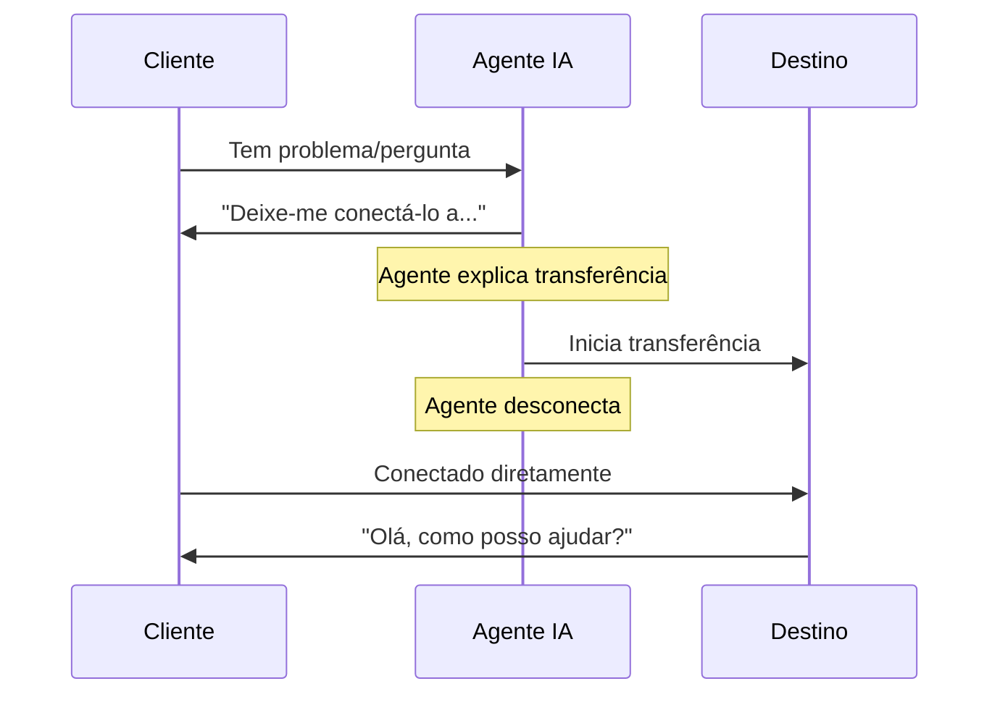

## Visão Geral

A ação Transferir é uma das ferramentas de controle de chamadas mais poderosas, permitindo que seus agentes de IA roteiem conversas perfeitamente para o destino certo quando ajuda especializada é necessária. Seja transferindo para especialistas humanos, outros agentes de IA ou sistemas telefônicos externos, a configuração adequada de transferência garante passagens suaves que mantêm a satisfação do cliente.

Este guia abrangente cobre tudo o que você precisa saber sobre destinos de transferência, modos de transferência, configurações avançadas e melhores práticas para roteamento confiável de chamadas.

<Note>
Transferências acontecem em tempo real durante chamadas ativas. O cliente permanece na linha enquanto está sendo conectado ao novo destino - ele não é desligado ou precisa ligar de volta.
</Note>

---

## Destinos de Transferência

O itellicoAI suporta três tipos de destinos de transferência. Escolha o que se adapta ao seu fluxo de trabalho:

<Frame>
  <div className="block dark:hidden">
    
  </div>
  <div className="hidden dark:block">
    
  </div>
</Frame>

<AccordionGroup>
  <Accordion title="Transferência de Agente" icon="users" defaultOpen>
    Transfira chamadas para outros agentes de IA na sua conta itellicoAI.

    ### Casos de Uso

    <CardGroup cols={2}>
      <Card title="Agentes Especializados" icon="user-gear">
        Roteie para agentes com conhecimento específico (cobrança, técnico, vendas)
      </Card>
      <Card title="Roteamento de Idiomas" icon="language">
        Transfira para agentes configurados para diferentes idiomas
      </Card>
      <Card title="Roteamento Departamental" icon="sitemap">
        Direcione para agentes projetados para departamentos específicos
      </Card>
      <Card title="Roteamento Baseado em Habilidades" icon="certificate">
        Conecte a agentes com capacidades especializadas
      </Card>
    </CardGroup>

    ### Configuração

    <Steps>
      <Step title="Selecione o tipo de transferência">
        Escolha **AGENTE** como o tipo de transferência
      </Step>
      <Step title="Escolha o agente de destino">
        Selecione o agente alvo no menu suspenso
      </Step>
      <Step title="Opcional: Adicione música de espera">
        Faça upload de áudio para tocar durante a conexão (opcional)
      </Step>
      <Step title="Opcional: Adicione toque de chamada">
        Adicione um som de toque durante a transferência (opcional)
      </Step>
    </Steps>

    ### Configurações de Áudio

    Transferências de agente suportam música de espera e toques de chamada personalizáveis:

    **Música de Espera:**
    - Toque música enquanto o cliente aguarda a conexão da transferência
    - Duração: 1-30 segundos (padrão: 6 segundos)
    - Use para: Experiência profissional durante atrasos de conexão
    - Não recomendado para: Transferências instantâneas quando conexão imediata é preferida

    **Duração do Toque:**
    - Toque som de chamada enquanto aguarda o agente de destino atender
    - Duração: 1-30 segundos (padrão: 4 segundos)
    - Ativado por padrão
    - Simula experiência normal de ligação

    **Configurações Combinadas:**
    Você pode ativar ambos para uma experiência completa de transferência:
    1. Música toca (ex: 6 segundos) - Experiência profissional de espera
    2. Toque toca (ex: 4 segundos) - Conexão em andamento
    3. Agente atende - Transferência completa

    **Atraso total:** Duração da música + Duração do toque (ex: 10 segundos)

    <Info>
    Para transferências instantâneas de agente para agente, desative música e toque para conexão imediata.
    </Info>

    ### Benefícios

    - Histórico de conversa transfere com a chamada
    - Sem custos telefônicos adicionais
    - Conexão instantânea (sem atraso de discagem)
    - Preservação completa de contexto
    - Música de espera e toque personalizáveis

    ### Exemplo de Instruções

    ```
    Quando um cliente relatar um problema técnico que requer solução:
    1. Colete informações básicas sobre o problema
    2. Explique que você está conectando-os a um especialista técnico
    3. Use a ação 'Transferir para Agente Técnico'
    ```
  </Accordion>

  <Accordion title="Transferência de Número de Telefone" icon="phone">
    Transfira chamadas para números de telefone externos - celulares, linhas fixas ou números comerciais.

    ### Casos de Uso

    <CardGroup cols={2}>
      <Card title="Especialistas Humanos" icon="user-headset">
        Conecte a agentes de suporte ao vivo
      </Card>
      <Card title="Equipes de Plantão" icon="mobile">
        Roteie para celulares para problemas urgentes
      </Card>
      <Card title="Departamentos Externos" icon="building">
        Transfira para equipes fora da sua conta
      </Card>
      <Card title="Contatos de Emergência" icon="triangle-exclamation">
        Escale situações críticas
      </Card>
    </CardGroup>

    ### Configuração

    <Steps>
      <Step title="Selecione o tipo de transferência">
        Escolha **TELEFONE** como o tipo de transferência
      </Step>
      <Step title="Insira o número de telefone">
        Insira o destino no formato E.164: `+1-555-123-4567`

        **Requisitos de formato:**
        - Deve incluir código do país (+1 para EUA/Canadá)
        - Sem espaços, traços ou parênteses
        - Exemplos: `+14155551234`, `+442071234567`, `+61398765432`
      </Step>
    </Steps>

    ### Custos e Limitações

    <Warning>
    **Importante:**
    - Transferências telefônicas incorrem em custos de chamadas de saída (tarifas variam por destino)
    - **Funcionam apenas durante chamadas telefônicas ativas** (não chamadas web ou conversas de widget)
    - Verifique números de telefone para evitar cobranças ou transferências falhadas
    </Warning>

    ### Exemplo de Instruções

    ```
    Para problemas urgentes fora do horário comercial:
    1. Verifique se o problema é realmente urgente
    2. Colete detalhes chave (nome do cliente, resumo do problema)
    3. Explique que você está conectando ao gerente de plantão
    4. Use a ação 'Transferir para Gerente de Plantão'
    ```
  </Accordion>

  <Accordion title="Transferência de Endereço SIP" icon="network-wired">
    Transfira chamadas para endereços SIP (URIs de Protocolo de Iniciação de Sessão) para integração com sistemas PBX e centrais de atendimento.

    ### Casos de Uso

    <CardGroup cols={2}>
      <Card title="Integração PBX" icon="phone-office">
        Roteie para ramais internos
      </Card>
      <Card title="Centrais de Atendimento" icon="users-viewfinder">
        Transfira para sistemas de fila ACD
      </Card>
      <Card title="Telefonia Empresarial" icon="building-columns">
        Conecte a sistemas telefônicos corporativos
      </Card>
      <Card title="Plataformas VoIP" icon="cloud">
        Integre com infraestrutura de voz
      </Card>
    </CardGroup>

    ### Configuração

    <Steps>
      <Step title="Pré-requisitos">
        Antes de configurar transferências SIP:
        - Tronco SIP configurado no itellicoAI
        - Endpoint SIP de destino alcançável
        - Autenticação adequada configurada
        - Roteamento de rede em vigor
      </Step>
      <Step title="Selecione o tipo de transferência">
        Escolha **SIP** como o tipo de transferência
      </Step>
      <Step title="Insira o endereço SIP">
        Insira URI SIP de destino: `sip:1001@yourpbx.example.com`

        **Requisitos de formato:**
        - Deve ser URI SIP válido
        - Incluir nome de usuário e domínio
        - Exemplos: `sip:support@pbx.company.com`, `sip:1234@10.0.1.50`
      </Step>
    </Steps>

    <Tip>
    Transferências SIP são ideais para empresas com sistemas telefônicos existentes. Elas fornecem integração perfeita entre agentes de IA e infraestrutura telefônica tradicional.
    </Tip>

    <Warning>
    **Transferências SIP funcionam apenas durante chamadas telefônicas ativas.** Elas não podem ser usadas durante chamadas web ou conversas de widget.
    </Warning>

    ### Exemplo de Instruções

    ```
    Para solicitações gerais de suporte:
    1. Colete informações do chamador
    2. Explique tempo de espera estimado
    3. Use a ação 'Transferir para Fila de Suporte'
    ```
  </Accordion>
</AccordionGroup>

---

## Modos de Transferência

### Transferência Fria (Padrão)

O agente transfere a chamada imediatamente e desconecta. O cliente conecta diretamente ao destino sem o agente apresentá-los.

#### Como Funciona



#### Exemplo de Fluxo

```
Cliente: "Tenho uma pergunta sobre cobrança"
Agente: "Fico feliz em ajudar. Deixe-me conectá-lo com nosso
        departamento de cobrança que pode acessar os detalhes da sua conta."
[Transferência fria para cobrança → Agente desconecta]
Agente de Cobrança: "Olá, como posso ajudá-lo?"
Cliente: "Tenho uma pergunta sobre minha conta..."
```

#### Opção de Transferência Silenciosa

<Accordion title="Ativar Transferência Silenciosa (Opcional)" icon="phone-slash">
  Você pode ativar o modo **Transferência Silenciosa** onde o agente transfere sem dizer nada - a chamada é imediatamente roteada para o destino.

  **Como funciona:**
  1. Lógica do agente aciona necessidade de transferência
  2. Transferência executa sem anúncio
  3. Cliente roteado para destino silenciosamente

  **Quando usar:**
  - Roteamento puro, sem conversa ainda (substituição de IVR)
  - Roteamento baseado em menu
  - Detecção de idioma e roteamento automático

  **Configuração:**
  - Marque a caixa de seleção **Transferência Silenciosa**
  - Qualquer mensagem de transferência é ignorada quando modo silencioso está ativado

  **Exemplo:**
  ```
  Agente: Roteador de Idiomas (agente de roteamento silencioso)

  Instruções:
  Baseado no idioma que o cliente fala:
  - Se espanhol detectado, use 'Transferir para Agente Espanhol' (silencioso)
  - Se francês detectado, use 'Transferir para Agente Francês' (silencioso)
  - Se inglês, continue conversa
  ```

  <Warning>
  Transferências silenciosas podem parecer abruptas para clientes. Use com moderação e apenas quando apropriado para o caso de uso.
  </Warning>
</Accordion>

### Transferência Quente

<Card title="Em Breve" icon="clock">
  **Transferências quentes** usam abordagem de chamada em três vias: o cliente ouve música de espera enquanto a IA inicia uma nova chamada para o destino em segundo plano. Uma vez que o destino atende, a IA fornece contexto (via mensagem sussurrada, resumo ou introdução em três vias) antes de conectar o cliente. Isso garante que o agente receptor seja informado e preparado antes de falar com o cliente.

  **Como funciona:**

  1. Cliente colocado em espera (ouve música de espera)
  2. IA inicia nova chamada para destino em segundo plano
  3. Destino atende, IA fornece briefing
  4. Cliente conectado ao agente de destino informado

  **Diferença chave da transferência fria:** IA mantém ambas as pernas da chamada e informa o destino antes de conectar o cliente, em vez de desconectar imediatamente.

  Este recurso está atualmente em desenvolvimento e estará disponível em uma versão futura.
</Card>

---

## Suporte Multi-Destino

Crie múltiplas ações de transferência para diferentes destinos para lidar com vários cenários de roteamento:

<AccordionGroup>
  <Accordion title="Configuração Completa de Roteamento" icon="sitemap">
    Configure múltiplos destinos de transferência para roteamento abrangente:

    ```text wrap
    Agente: Roteador de Atendimento ao Cliente

    Ações de Transferência Configuradas:
    1. Transferir para Departamento de Cobrança (+1-555-100-0001)
    2. Transferir para Suporte Técnico (+1-555-100-0002)
    3. Transferir para Equipe de Vendas (+1-555-100-0003)
    4. Transferir para Departamento de Devoluções (+1-555-100-0004)
    5. Transferir para Gerente (sip:manager@pbx.company.com)
    6. Transferir para Agente Espanhol (ID do Agente: ag_spanish_01)

    Instruções:
    Roteie clientes para o departamento apropriado:

    Perguntas de cobrança → 'Transferir para Departamento de Cobrança'
    Problemas técnicos → 'Transferir para Suporte Técnico'
    Consultas de vendas → 'Transferir para Equipe de Vendas'
    Solicitações de devolução → 'Transferir para Departamento de Devoluções'
    Escalações → 'Transferir para Gerente'
    Falantes de espanhol → 'Transferir para Agente Espanhol'

    Sempre explique para quem você está conectando-os antes de transferir.
    ```
  </Accordion>

  <Accordion title="Cadeias de Fallback" icon="arrow-turn-down-right">
    Configure múltiplas opções de transferência com lógica de fallback:

    ```text wrap
    Caminho de escalação primário:
    1. Tentar 'Transferir para Suporte Técnico'
    2. Se falhar, tentar 'Transferir para Suporte Geral'
    3. Se isso falhar, tentar 'Transferir para Gerente'
    4. Se tudo falhar, peça desculpas e agende retorno

    Instruções:
    Se a transferência primária falhar, o agente deve tentar o backup,
    e lidar com falha completa elegantemente coletando informações de retorno.
    ```
  </Accordion>

  <Accordion title="Roteamento Condicional" icon="code-branch">
    Use diferentes transferências baseadas em dados do cliente ou contexto da conversa:

    ```jinja
    
    Roteie clientes corporativos para 'Transferir para Suporte Corporativo'
    
    Roteie clientes premium para 'Transferir para Suporte Premium'
    
    Roteie clientes padrão para 'Transferir para Suporte Geral'
    
    ```
  </Accordion>
</AccordionGroup>

---

## Melhores Práticas

<AccordionGroup>
  <Accordion title="Sempre Explique a Transferência" icon="comment">
    Nunca transfira chamadas sem contexto. Explique para quem você está conectando-os e por quê.

    **Bom:**
    ```
    "Entendo que você precisa de ajuda com sua conta. Deixe-me conectá-lo
    com nosso departamento de cobrança que pode acessar sua conta e
    fazer os ajustes necessários. Isso levará apenas um momento."
    ```

    **Ruim:**
    ```
    "Aguarde por favor." [transferência imediata]
    ```
  </Accordion>

  <Accordion title="Defina Expectativas do Cliente" icon="clock">
    Diga aos clientes o que esperar durante e após a transferência.

    **Bom:**
    ```
    "Vou conectá-lo com nossa equipe técnica. Você ouvirá
    uma breve mensagem de espera, depois eles atenderão em 30 segundos.
    Eles terão suas informações prontas."
    ```

    **Ruim:**
    ```
    "Transferindo agora." [cliente não sabe o que está acontecendo]
    ```
  </Accordion>

  <Accordion title="Colete Informações Primeiro" icon="clipboard">
    Colete detalhes básicos antes de transferir para que o destinatário tenha contexto e o cliente não precise se repetir.

    ```
    Antes de transferir:
    1. Obter nome do cliente
    2. Entender problema básico
    3. Coletar número de conta/pedido se relevante
    4. Perguntar sobre urgência
    5. Então transferir com contexto
    ```
  </Accordion>

  <Accordion title="Use Nomes Descritivos" icon="tag">
    Nomeie cada ação de transferência claramente baseado no destino.

    **Bom:**
    - "Transferir para Departamento de Cobrança"
    - "Escalar para Suporte Técnico"
    - "Rotear para Agente de Fala Espanhola"
    - "Conectar ao Gerente de Plantão"

    **Ruim:**
    - "Transferência 1"
    - "Transferência Telefônica"
    - "Escalar"
  </Accordion>

  <Accordion title="Trate Falhas de Transferência" icon="triangle-exclamation">
    Sempre tenha um plano para quando transferências falham (ocupado, sem resposta, etc.).

    ```
    Se a ação 'Transferir para Suporte' falhar:
    1. Peça desculpas: "Peço desculpas, estou tendo problemas para conectar agora"
    2. Ofereça retorno: "Posso fazer nossa equipe de suporte ligar de volta
       dentro da próxima hora"
    3. Colete número de retorno e melhor horário
    4. Confirme: "Ótimo, espere uma ligação nossa no [número] dentro de uma hora"
    5. Use a ação 'Encerrar Chamada Educadamente'
    ```
  </Accordion>

  <Accordion title="Use Formato E.164 para Números de Telefone" icon="phone">
    Sempre formate números de telefone corretamente para evitar falhas de transferência.

    **Formato E.164 correto:**
    - Incluir código do país: `+1` para EUA/Canadá
    - Sem espaços, traços ou parênteses
    - Exemplos: `+14155551234`, `+442071234567`

    **Formatos incorretos:**
    - ❌ `(415) 555-1234`
    - ❌ `415-555-1234`
    - ❌ `14155551234` (faltando +)
    - ❌ `+1 415 555 1234` (espaços)
  </Accordion>

  <Accordion title="Considere Custos para Transferências Telefônicas" icon="dollar-sign">
    Esteja atento aos custos de telefonia, especialmente para transferências internacionais.

    **Otimização de custos:**
    - Use transferências de agente quando possível (grátis)
    - Use transferências SIP para roteamento interno (tipicamente grátis ou baixo custo)
    - Limite transferências telefônicas a escalações necessárias
    - Monitore frequência de transferências e custos
    - Configure alertas para volumes incomuns de transferência
  </Accordion>

</AccordionGroup>

---

## Testando Ações de Transferência

Teste todos os destinos de transferência antes de entrar no ar para garantir operação confiável:

**Testes essenciais:**
- Transferência executa e destino recebe chamada
- Qualidade de áudio é boa em ambas as direções
- Agente explica transferência apropriadamente nas instruções
- Cenários de falha tratados elegantemente (sem resposta, sinal de ocupado, destino inválido)
- Teste de diferentes fontes de chamada (telefone, web)

<Info>
Para transferências telefônicas/SIP, confirme formatação E.164 adequada e alcance do destino.
</Info>

---

## Solução de Problemas

<AccordionGroup>
  <Accordion title="Transferência Conecta Mas Cai Imediatamente" icon="phone-slash">
    **Sintomas:** Transferência parece conectar, mas chamada termina imediatamente

    **Possíveis causas:**
    - Destino não configurado para aceitar transferências
    - Problema de configuração de endpoint SIP
    - Agente não ativo (para transferências de agente)
    - Bloqueio de rede/firewall

    **Soluções:**
    - Verifique se agente de destino está ativo e publicado
    - Teste número de telefone de destino independentemente
    - Verifique configuração e autenticação de tronco SIP
    - Revise regras de firewall para tráfego SIP
    - Verifique "Não Perturbe" ou bloqueio de chamadas no destino
  </Accordion>

  <Accordion title="Sem Áudio Após Transferência" icon="volume-xmark">
    **Sintomas:** Transferência conecta mas sem áudio em uma ou ambas direções

    **Possíveis causas:**
    - Portas RTP (mídia) bloqueadas
    - Problemas de travessia NAT
    - Incompatibilidade de codec
    - Configurações de áudio de endpoint SIP

    **Soluções:**
    - Verifique se portas RTP estão abertas (tipicamente 10000-20000)
    - Verifique configuração NAT em endpoints SIP
    - Certifique-se de que codecs compatíveis estão configurados (G.711, Opus)
    - Teste áudio com chamada de teste simples primeiro
    - Revise configurações de áudio de tronco SIP
  </Accordion>

  <Accordion title="Transferências Telefônicas Falham Com Erro" icon="circle-exclamation">
    **Sintomas:** Ação de transferência retorna erro, chamada não conectada

    **Possíveis causas:**
    - Formato de número de telefone inválido
    - Saldo de conta insuficiente
    - Número não alcançável
    - Restrições de operadora

    **Soluções:**
    - Verifique formato E.164: +14155551234 (não (415) 555-1234)
    - Verifique saldo de conta e créditos de telefonia
    - Teste com número de telefone diferente
    - Verifique se país de destino é suportado
    - Verifique bloqueio de operadora ou filtros de spam
  </Accordion>

  <Accordion title="Transferências de Agente Não Preservam Contexto" icon="message-slash">
    **Sintomas:** Contexto/histórico não disponível para agente receptor

    **Possíveis causas:**
    - Problema de configuração
    - Agentes em contas diferentes
    - Configuração de modo de transferência

    **Soluções:**
    - Verifique se ambos os agentes estão na mesma conta itellicoAI
    - Verifique se transferência está configurada como transferência de agente, não telefone
    - Revise configurações de transferência de agente
    - Teste com transferência simples agente-para-agente
    - Contate suporte se problema persistir
  </Accordion>

  <Accordion title="Música de Espera Não Toca" icon="music-slash">
    **Sintomas:** Transferência acontece mas sem música de espera

    **Possíveis causas:**
    - Música de espera desativada nas configurações
    - Duração definida como 0
    - Transferência de agente (música apenas para telefone/SIP)

    **Soluções:**
    - Ative caixa de seleção "Tocar Música" nas configurações de transferência
    - Defina duração da música (4-8 segundos recomendado)
    - Verifique se tipo de transferência suporta música (nem todas transferências de agente usam música)
    - Teste com transferência telefônica para confirmar que música funciona
  </Accordion>

  <Accordion title="Toque Não Toca" icon="bell-slash">
    **Sintomas:** Sem som de toque durante transferência

    **Possíveis causas:**
    - Toque desativado nas configurações
    - Duração do toque definida como 0
    - Transferência completa antes do toque começar

    **Soluções:**
    - Ative caixa de seleção "Deve Tocar"
    - Defina duração do toque (4-6 segundos típico)
    - Ajuste duração da música se toque deve tocar depois
    - Verifique se destino realmente suporta toque
  </Accordion>

  <Accordion title="Transferências SIP Falham ao Conectar" icon="network-wired">
    **Sintomas:** Transferências SIP retornam erros ou não conectam

    **Possíveis causas:**
    - Formato de URI SIP inválido
    - Tronco SIP não configurado
    - Falha de autenticação
    - Problema de roteamento de rede

    **Soluções:**
    - Verifique formato de URI SIP: sip:user@domain.com
    - Verifique se tronco SIP está configurado no itellicoAI
    - Verifique se credenciais SIP estão corretas
    - Teste endpoint SIP com cliente SIP
    - Verifique resolução DNS para domínio SIP
    - Revise regras de firewall para tráfego SIP (porta 5060/5061)
  </Accordion>

  <Accordion title="ID do Chamador Mostra Número Errado" icon="id-card">
    **Sintomas:** Chamada transferida exibe ID de chamador incorreto

    **Possíveis causas:**
    - Passagem de ID de chamador de tronco SIP não configurada
    - Configurações de PBX bloqueando ID de chamador
    - Operadora bloqueando ou modificando ID de chamador

    **Soluções:**
    - Verifique se seu tronco SIP está configurado para passar ID de chamador corretamente
    - Verifique configurações de ID de chamador do seu PBX
    - Algumas operadoras bloqueiam passagem de ID de chamador - verifique com sua operadora
    - Você pode precisar configurar IDs de chamador permitidos no seu tronco SIP
  </Accordion>
</AccordionGroup>

---

## Exemplos do Mundo Real

<AccordionGroup>
  <Accordion title="Roteamento de Suporte Multi-Nível" icon="layer-group">
    Roteie problemas de suporte por nível de complexidade:

    ```text wrap
    Agente: Roteador de Suporte ao Cliente

    Ações de Transferência:
    - Transferir para Suporte L1 (sip:support-l1@queue.company.com)
    - Transferir para Suporte L2 (sip:support-l2@queue.company.com)
    - Transferir para Engenharia (+1-555-100-9999)

    Instruções:
    Roteie problemas de suporte por complexidade:

    Perguntas simples (redefinição de senha, perguntas de conta):
    - Responda diretamente usando base de conhecimento
    - Não transfira a menos que cliente solicite

    Complexidade média (perguntas sobre recursos, bugs menores):
    - Tente ajudar usando base de conhecimento
    - Se não conseguir resolver, use 'Transferir para Suporte L1'

    Alta complexidade (interrupções de sistema, bugs críticos):
    - Colete informações detalhadas
    - Use 'Transferir para Suporte L2'

    Emergências críticas (perda de dados, incidentes de segurança):
    - Colete todos os detalhes imediatamente
    - Use 'Transferir para Engenharia' sem demora
    ```
  </Accordion>

  <Accordion title="Qualificação de Vendas com Transferência" icon="chart-line">
    Qualifique leads e roteie para equipe de vendas apropriada:

    ```text wrap
    Agente: Agente de Qualificação de Vendas

    Ações de Transferência:
    - Transferir para Vendas Internas (+1-555-200-1000)
    - Transferir para Vendas Corporativas (+1-555-200-2000)
    - Transferir para Sucesso do Cliente (sip:cs-team@company.com)

    Instruções:
    Para consultas de vendas de entrada:

    1. Cumprimente e entenda o interesse
    2. Faça perguntas qualificadoras:
       - Tamanho da empresa
       - Faixa de orçamento
       - Cronograma
       - Autoridade de decisão

    Baseado nas respostas:

    Pequena empresa (<50 funcionários, <$10k orçamento):
    - Forneça recursos de autoatendimento
    - Ofereça agendar demo via ação de agendamento
    - Não transfira a menos que solicitem

    Mercado médio (50-500 funcionários, $10k-$100k orçamento):
    - Use 'Transferir para Vendas Internas'
    - Explique: "Estou conectando você com um executivo de conta
      que pode discutir nossos pacotes para mercado médio"

    Corporativo (500+ funcionários, $100k+ orçamento):
    - Use 'Transferir para Vendas Corporativas'
    - Explique: "Estou conectando você com nossa equipe corporativa
      que especializa em implementações grandes"

    Cliente existente querendo expansão:
    - Use 'Transferir para Sucesso do Cliente'
    ```
  </Accordion>

  <Accordion title="Roteamento Fora do Horário" icon="moon">
    Trate chamadas fora do horário comercial:

    <Tip>
    **Melhor prática:** Se você tem um sistema PBX, trate roteamento fora do horário no nível do PBX para confiabilidade e controle superiores.
    </Tip>

    ```text wrap
    Agente: Suporte Fora do Horário

    Ações de Transferência:
    - Transferir para Engenheiro de Plantão (+1-555-emergency)
    - Transferir para Correio de Voz (sip:vm@pbx.company.com)

    Instruções:
    Fora do horário comercial normal (Seg-Sex 9h-17h):

    1. Cumprimente: "Obrigado por ligar. Nossos escritórios estão fechados no momento."

    2. Pergunte sobre urgência:
       "É um problema urgente afetando suas operações comerciais?"

    Se urgente/emergência:
    - Colete detalhes: nome, empresa, descrição do problema, impacto
    - Explique: "Estou conectando você ao nosso engenheiro de plantão que pode
      ajudar imediatamente"
    - Use 'Transferir para Engenheiro de Plantão'

    Se não urgente:
    - Explique horário comercial
    - Ofereça opções:
      a) Deixar correio de voz (Use 'Transferir para Correio de Voz')
      b) Agendar retorno para próximo dia útil (Use ação de agendamento)
      c) Visite base de conhecimento de autoatendimento
    ```
  </Accordion>
</AccordionGroup>

---

## Configurações Avançadas

<AccordionGroup>
  <Accordion title="Roteamento de Destino Dinâmico" icon="globe">
    Use variáveis para determinar dinamicamente destinos de transferência:

    ```jinja
    
    Destino de transferência: +1-555-WEST-001
    
    Destino de transferência: +1-555-EAST-001
    
    Destino de transferência: +1-555-MAIN-001
    

    Ao transferir, use o número regional apropriado.
    ```
  </Accordion>

  <Accordion title="Roteamento Baseado em Tempo" icon="clock">
    Roteie transferências baseado na hora do dia:

    ```jinja
    

    
    Horário comercial: Use 'Transferir para Equipe de Suporte'
    
    Fora do horário: Use 'Transferir para Suporte de Plantão'
    
    ```

    <Info>
    A variável `current_datetime` deve ser passada para seu agente via [Contexto Dinâmico](/pt/build/advanced/dynamic-context). Configure um endpoint de contexto que retorna esses dados nas configurações operacionais do seu agente.
    </Info>
  </Accordion>

  <Accordion title="Roteamento Baseado em Habilidades" icon="user-gear">
    Roteie baseado em expertise necessária:

    ```text wrap
    Determine habilidade necessária:
    - Pergunta de cobrança → 'Transferir para Especialista em Cobrança'
    - Problema técnico → 'Transferir para Suporte Técnico'
    - Pergunta de produto → 'Transferir para Especialista em Produto'
    - Gerenciamento de conta → 'Transferir para Gerente de Conta'

    Use tipo de conta do cliente para influenciar roteamento:
    - Contas VIP sempre recebem transferências de fila prioritária
    - Contas corporativas roteiam para suporte dedicado
    - Contas padrão roteiam para fila de suporte geral
    ```
  </Accordion>
</AccordionGroup>

---

## Próximos Passos

<CardGroup cols={2}>
  <Card title="Ações de Controle de Chamadas" icon="phone" href="/pt/build/actions/call-control">
    Aprenda sobre ações de Encerrar Conversa e Gerenciamento de Inatividade
  </Card>
  <Card title="Visão Geral de Ações" icon="bolt" href="/pt/build/actions/overview">
    Entenda todos os tipos de ações e quando usá-las
  </Card>
  <Card title="Ações de Agendamento" icon="calendar" href="/pt/build/actions/booking-calendar">
    Configure agendamento de compromissos com Cal.com
  </Card>
  <Card title="Ações de API Personalizadas" icon="code" href="/pt/build/actions/custom-api-actions">
    Conecte a sistemas e APIs externos
  </Card>
  <Card title="Guia de Instruções" icon="pen" href="/pt/build/conversation/instructions">
    Escreva instruções eficazes para transferências confiáveis
  </Card>
  <Card title="Teste Seu Agente" icon="vial" href="/pt/test/web-simulator">
    Guia de teste abrangente para agentes com transferências
  </Card>
</CardGroup>
