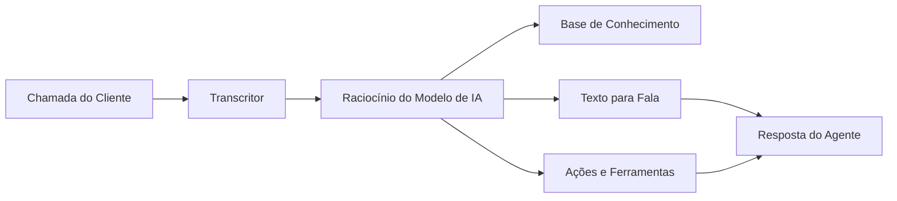

## O Que é um Agente de Voz com IA?

Um agente de voz com IA é um assistente virtual inteligente que pode gerenciar conversas de voz com seus clientes por telefone e web. Ao contrário de sistemas IVR tradicionais ou chatbots, os agentes itellicoAI entendem linguagem natural, mantêm contexto ao longo das conversas e podem executar ações reais como agendar compromissos, transferir chamadas ou atualizar seus sistemas.

## Capacidades Principais

Seus agentes itellicoAI podem:

<CardGroup cols={2}>
  <Card title="Entender Linguagem Natural" icon="brain">
    Compreender intenção do cliente, perguntas e solicitações em conversa natural
  </Card>
  <Card title="Acessar Seu Conhecimento" icon="book">
    Referenciar informações do seu negócio, políticas e documentação durante chamadas
  </Card>
  <Card title="Executar Ações" icon="bolt">
    Agendar compromissos, transferir chamadas, atualizar sistemas e acionar fluxos de trabalho
  </Card>
  <Card title="Falar Naturalmente" icon="microphone">
    Responder com vozes de som natural em múltiplos idiomas
  </Card>
</CardGroup>

## Como Funcionam os Agentes de Voz com IA

1. **Cliente fala** - Seu cliente faz uma pergunta ou solicitação
2. **Transcritor** - O agente converte fala em texto usando transcrição avançada
3. **Raciocínio de IA** - O modelo de linguagem entende a intenção e formula uma resposta
4. **Recuperação de conhecimento** - Agente acessa seu conhecimento de negócio quando necessário
5. **Execução de ação** - Agente pode acionar reservas, transferências ou chamadas de API
6. **Síntese de fala** - Resposta é convertida em fala de som natural
7. **Agente responde** - Cliente ouve uma resposta útil e contextual

## Benefícios Principais

<CardGroup cols={2}>
  <Card title="Disponibilidade 24/7" icon="clock">
    Nunca dorme, sempre pronto para ajudar em qualquer fuso horário
  </Card>

  <Card title="Qualidade Consistente" icon="star">
    Toda interação segue suas diretrizes e voz da marca
  </Card>

  <Card title="Escalabilidade Instantânea" icon="chart-line">
    Lide com 1 chamada ou 1.000 simultaneamente sem mudanças de infraestrutura
  </Card>

  <Card title="Eficiência de Custos" icon="dollar-sign">
    Reduza custos enquanto libera equipe humana para questões complexas
  </Card>

  <Card title="Integração Rica" icon="plug">
    Conecte a CRMs, calendários e ferramentas de negócios para acesso a dados em tempo real
  </Card>
</CardGroup>

## Casos de Uso Comuns

<AccordionGroup>
  <Accordion title="Suporte ao Cliente" icon="headset">
    Responda FAQs, solucione problemas e escale casos complexos para agentes humanos
  </Accordion>

  <Accordion title="Agendamento de Compromissos" icon="calendar">
    Agende, reagende e envie confirmações e lembretes automatizados
  </Accordion>

  <Accordion title="Qualificação de Leads" icon="user-plus">
    Envolva prospects, colete informações e encaminhe leads qualificados para vendas
  </Accordion>

  <Accordion title="Status e Rastreamento de Pedidos" icon="box">
    Verifique status de pedidos e forneça atualizações de rastreamento
  </Accordion>

  <Accordion title="Pagamento e Faturamento" icon="credit-card">
    Responda perguntas sobre faturamento, processe pagamentos e envie lembretes
  </Accordion>

  <Accordion title="Coleta de Feedback" icon="comment">
    Conduza pesquisas e colete feedback de clientes em escala
  </Accordion>
</AccordionGroup>

## Próximos Passos

Pronto para construir seu primeiro agente? Continue com:

<CardGroup cols={2}>
  <Card title="Criar Seu Primeiro Agente" icon="plus" href="/pt/build/getting-started/create-first-agent">
    Guia passo a passo para criar seu primeiro agente de voz com IA
  </Card>
  <Card title="Tipos de Agente e Casos de Uso" icon="list" href="/pt/build/getting-started/agent-use-cases">
    Entenda diferentes tipos de agente e quando usar cada um
  </Card>
</CardGroup>
