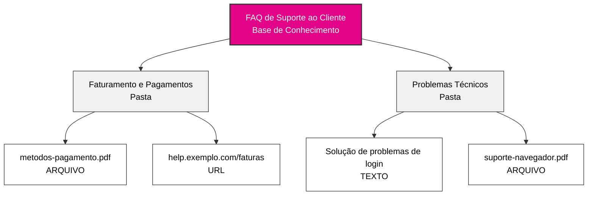
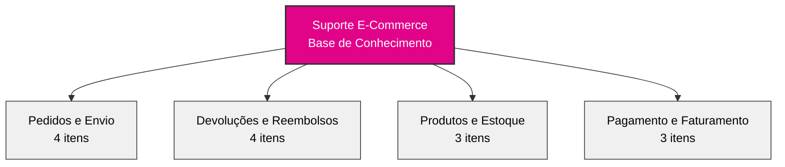

## Visão Geral

As bases de conhecimento transformam seu agente de IA de um assistente genérico em um especialista em negócios. Ao organizar as informações da sua empresa em uma hierarquia estruturada, seu agente pode acessar e referenciar instantaneamente políticas, procedimentos, detalhes de produtos e qualquer outra informação na qual seu negócio se baseia.

Pense nas bases de conhecimento como arquivos inteligentes que seu agente pode pesquisar em milissegundos durante conversas.

## Arquitetura de Conhecimento

### A Hierarquia de Três Níveis

O conhecimento no itellicoAI segue uma estrutura simples e intuitiva:

**Base de Conhecimento → Pastas → Itens**

Os itens podem ser **texto**, **arquivos** (PDF, Word, Markdown, CSV, JSON, YAML, XML, etc.) ou **URLs** (apenas uma página web - não sites inteiros).

Esta hierarquia facilita a organização de grandes quantidades de informação, mantendo-a acessível e gerenciável.

---

## Visão Geral do Painel

### Interface Principal de Conhecimento

Navegue até **Conhecimento** na barra lateral esquerda para acessar seu painel de gerenciamento de conhecimento com uma visão geral de todas as suas bases de conhecimento:

<CardGroup cols={1}>
  <Card title="FAQ de Suporte ao Cliente">
    - 127 itens
    - Atualizado Hoje
  </Card>
  <Card title="Documentação do Produto">
    - 89 itens
    - Atualizado Ontem
  </Card>
  <Card title="Políticas da Empresa">
    - 45 itens
    - Atualizado há 3 dias
  </Card>
</CardGroup>

Cada cartão de base de conhecimento mostra:
- Número total de itens em todas as pastas
- Timestamp da última atualização
- Ações: Copiar placeholder de referência, Editar, Excluir

---

## Entendendo Cada Nível

### Bases de Conhecimento

<Card title="O que é uma Base de Conhecimento?" icon="database">
  Uma base de conhecimento é o contêiner de nível superior que agrupa informações relacionadas. Representa uma categoria ou domínio principal do conhecimento do seu negócio.
</Card>

**Pense nas bases de conhecimento como diferentes arquivos no seu escritório:**
- Um arquivo para materiais de suporte ao cliente
- Outro para documentação de produto
- Outro para políticas da empresa
- Outro para recursos de vendas

**Exemplos de bases de conhecimento:**
- **FAQ de Suporte ao Cliente** - Todas as informações de suporte voltadas ao cliente
- **Documentação do Produto** - Documentos técnicos, guias do usuário, descrições de recursos
- **Políticas da Empresa** - Políticas de RH, documentos de conformidade, procedimentos internos
- **Recursos de Vendas** - Tabelas de preços, comparações com concorrentes, apresentações

### Pastas

<Card title="O que é uma Pasta?" icon="folder">
  Pastas são unidades organizacionais dentro de uma base de conhecimento. Elas agrupam itens relacionados por tópico, categoria ou propósito.
</Card>

**Pense nas pastas dentro do seu arquivo:**
- Elas organizam conteúdo semelhante juntos
- Facilitam encontrar e gerenciar informações
- Permitem atribuir tópicos específicos aos agentes

**Exemplos de pastas dentro de uma base de conhecimento de Suporte ao Cliente:**
- **Faturamento e Pagamentos** - Perguntas sobre faturas, métodos de pagamento, reembolsos
- **Problemas Técnicos** - Guias de solução de problemas, mensagens de erro, soluções alternativas para bugs
- **Informações sobre Produtos** - Recursos, especificações, compatibilidade
- **Políticas de Devolução** - Prazos de devolução, condições, etapas do processo

<Tip>
Use nomes de pastas claros e descritivos. Sua equipe e sua IA se beneficiarão da organização intuitiva.
</Tip>

### Itens de Conhecimento

<Card title="O que é um Item de Conhecimento?" icon="file">
  Itens de conhecimento são as peças reais de informação - documentos, FAQs, políticas, procedimentos ou qualquer conteúdo que você queira que seu agente saiba.
</Card>

**Itens de conhecimento podem ser:**
- **Entradas de texto** - Conteúdo escrito diretamente
- **Upload de arquivos** - PDF, Word (.doc, .docx), Texto (.txt, .log), Markdown (.md), CSV/TSV, JSON, YAML, XML (até 10MB)
- **Scraping de URL** - Conteúdo de uma única página web (não sites inteiros)

**Exemplos de itens de conhecimento:**
- "Política de Reembolso para Produtos Digitais"
- "Como Redefinir Senha - Passo a Passo"
- "Especificações do Produto - Modelo X200"
- "Prazos de Envio por Região"

Cada item de conhecimento inclui:
- **Título** - Nome descritivo do conteúdo
- **Conteúdo/Fonte** - A informação real (texto, arquivo ou URL)
- **Status de Processamento de Conteúdo** - Estado de extração (Pendente, Processando, Concluído, Falhou)
- **Status de Indexação Vetorial** - Estado de preparação RAG (Pendente, Indexando, Indexado, Falhou)
- **Metadados** - Data de criação, última atualização, tamanho do conteúdo, contagem de tokens

---

## Quando Usar Bases de Conhecimento

<AccordionGroup>
  <Accordion title="Seu agente precisa responder perguntas específicas" icon="circle-question">
    Se os clientes perguntarem regularmente sobre políticas, procedimentos ou detalhes de produtos, adicione essas informações a uma base de conhecimento. Seu agente as referenciará com precisão todas as vezes.

    **Exemplo:** Cliente pergunta "Qual é a sua política de devolução?" O agente recupera a política exata da sua base de conhecimento e a explica naturalmente.
  </Accordion>

  <Accordion title="Você tem documentação detalhada" icon="book">
    Se você tem documentação existente - manuais do usuário, FAQs, documentos de política - pode fazer upload diretamente em vários formatos (PDF, DOC, DOCX, TXT). Seu agente poderá pesquisar e referenciá-los em conversas.

    **Exemplo:** Faça upload do seu manual de produto de 50 páginas. Quando clientes tiverem perguntas técnicas, seu agente encontra e explica as seções relevantes.
  </Accordion>

  <Accordion title="Informações mudam frequentemente" icon="arrows-rotate">
    Bases de conhecimento facilitam a atualização de informações sem alterar as instruções principais do seu agente. Atualize uma tabela de preços ou documento de política, e seu agente instantaneamente terá as novas informações.

    **Exemplo:** Você atualiza seu documento de preços uma vez, e todos os agentes usando essa base de conhecimento imediatamente referenciam os novos preços.
  </Accordion>

  <Accordion title="Vários agentes precisam das mesmas informações" icon="users">
    Crie uma base de conhecimento e compartilhe-a entre vários agentes. Mantenha informações em um único lugar, use-as em todos os lugares.

    **Exemplo:** Sua base de conhecimento "Especificações de Produto" pode ser usada pelo seu agente de vendas, agente de suporte e agente de qualificação de pré-vendas.
  </Accordion>

  <Accordion title="Você quer separar responsabilidades" icon="layer-group">
    Mantenha as instruções conversacionais do seu agente separadas das informações factuais. As instruções definem personalidade e comportamento; as bases de conhecimento fornecem fatos e detalhes.

    **Exemplo:** As instruções do seu agente dizem "seja amigável e profissional". Sua base de conhecimento contém as especificações reais do produto, preços e políticas.
  </Accordion>
</AccordionGroup>

---

## Melhores Práticas de Organização

### Comece com Categorias Claras

<CardGroup cols={2}>
  <Card title="Por Departamento" icon="building">
    - Conhecimento de Vendas
    - Conhecimento de Suporte
    - Conhecimento de Faturamento
    - Documentação Técnica
  </Card>
  <Card title="Por Tópico" icon="tags">
    - Informações sobre Produtos
    - Políticas e Procedimentos
    - Solução de Problemas
    - FAQs
  </Card>
  <Card title="Por Jornada do Cliente" icon="map">
    - Informações de Pré-Venda
    - Guias de Integração
    - Uso e Recursos
    - Suporte e Solução de Problemas
  </Card>
  <Card title="Por Público" icon="user-group">
    - Informações Voltadas ao Cliente
    - Procedimentos Internos
    - Recursos para Parceiros
    - Especificações Técnicas
  </Card>
</CardGroup>

### Convenções de Nomenclatura

Use nomes claros e consistentes que façam sentido para toda a sua equipe:

**Bons exemplos de nomenclatura:**
- Base de Conhecimento: "Recursos de Suporte ao Cliente"
- Pasta: "Faturamento e Pagamentos"
- Item: "Política de Reembolso - Produtos Digitais"

**Exemplos ruins de nomenclatura:**
- Base de Conhecimento: "BC_001"
- Pasta: "Docs Diversos"
- Item: "Politica_v2_final_ATUALIZADO"

<Tip>
Inclua datas ou números de versão nos títulos dos itens se você mantiver várias versões: "Tabela de Preços - Q1 2025"
</Tip>

### Exemplo de Base de Conhecimento Bem Estruturada

Aqui está um exemplo de uma base de conhecimento de e-commerce bem organizada:

**Conteúdo das pastas:**
- **Pedidos e Envio:** Rastreamento, prazos de envio, informações internacionais, modificações
- **Devoluções e Reembolsos:** Política, processo de envio, prazos de processamento, trocas
- **Produtos e Estoque:** Categorias, disponibilidade de estoque, especificações
- **Pagamento e Faturamento:** Métodos de pagamento, faturas, planos de pagamento

**O que torna esta estrutura boa:**
- Nomes de pastas claros e descritivos que agrupam conteúdo relacionado
- Distribuição equilibrada (3-4 itens por pasta)
- Fácil de navegar e encontrar informações
- Escala bem à medida que você adiciona mais conteúdo

### Extrair Apenas Conteúdo Relevante

<Warning>
**Mais conhecimento ≠ Melhor desempenho**

Adicionar muito conhecimento aumenta a chance de seu agente recuperar informações irrelevantes junto com o que é realmente necessário.
</Warning>

**Melhor prática para documentos grandes:**

Em vez de fazer upload de manuais ou documentos de política inteiros, extraia apenas as páginas/seções que seu agente precisa.

<AccordionGroup>
  <Accordion title="❌ Evite: Fazer upload do manual completo do funcionário de 200 páginas" icon="xmark">
    **Problema:**
    - Agente encontra e mistura seções irrelevantes com a resposta certa
    - Mais difícil para o agente determinar o que é realmente relevante
    - Desperdiça espaço de conversa com conteúdo não relacionado

    **Exemplo:**
    Cliente pergunta: "Qual é a sua política de devolução?"

    O agente pode trazer: políticas de férias de RH, procedimentos internos, benefícios para funcionários — e ter dificuldade em separar o que o cliente realmente precisa.
  </Accordion>

  <Accordion title="✅ Melhor: Extrair seções específicas" icon="check">
    **Abordagem:**
    - "Política de Devolução - Páginas 45-48"
    - "Política de Envio - Páginas 52-55"
    - "Termos de Garantia - Páginas 89-92"

    **Benefício:**
    - Agente encontra apenas conteúdo relevante para o cliente
    - Respostas mais claras e precisas
    - Uso mais eficiente do espaço de conversa

    **Exemplo:**
    Cliente pergunta: "Qual é a sua política de devolução?"

    Agente recupera: Apenas a seção de política de devolução de 4 páginas — exatamente o que é necessário, nada mais.
  </Accordion>
</AccordionGroup>

**Como extrair seções relevantes:**
- Exporte páginas específicas de PDF como arquivos separados
- Copie seções relevantes em itens de TEXTO
- Link para URLs com âncoras específicas em vez de sites de documentação inteiros

### Manutenção Regular

<Steps>
  <Step title="Revisar trimestralmente">
    Agende revisões regulares das suas bases de conhecimento para garantir que as informações permaneçam atualizadas.
  </Step>
  <Step title="Remover conteúdo desatualizado">
    Exclua itens que não são mais relevantes ou desvinculam-nos dos agentes. Informações desatualizadas podem confundir seu agente e fornecer respostas incorretas.
  </Step>
  <Step title="Atualizar com base no feedback">
    Se clientes relatarem informações incorretas, verifique sua base de conhecimento imediatamente.
  </Step>
</Steps>

---

## Exemplos do Mundo Real

<AccordionGroup>
  <Accordion title="Agente de Suporte SaaS" icon="headset">
    **Base de Conhecimento:** "Suporte do Produto SaaS"

    **Pastas:**
    - **Gerenciamento de Conta** (15 itens)
      - Processo de redefinição de senha
      - Instruções de upgrade de conta
      - Informações de ciclo de faturamento
      - Tabela de comparação de planos
    - **Documentação de Recursos** (47 itens)
      - Guias de recursos individuais
      - Tutoriais de integração
      - Documentação da API
      - Melhores práticas
    - **Solução de Problemas** (23 itens)
      - Mensagens de erro comuns
      - Problemas de conexão
      - Compatibilidade de navegadores
      - Otimização de desempenho

    **Resultado:** Agente de suporte pode responder 80% das perguntas técnicas sem intervenção humana.
  </Accordion>

  <Accordion title="Agente de Agendamento em Saúde" icon="calendar">
    **Base de Conhecimento:** "Serviços ao Paciente"

    **Pastas:**
    - **Políticas de Agendamento** (8 itens)
      - Diretrizes de agendamento
      - Política de cancelamento
      - Requisitos de seguro
      - Processo para novos pacientes
    - **Informações do Consultório** (5 itens)
      - Locais e horários do consultório
      - Instruções de estacionamento
      - Informações de acessibilidade
      - Diretório de contatos
    - **Seguro e Faturamento** (12 itens)
      - Provedores de seguro aceitos
      - Opções de pagamento
      - Perguntas sobre faturamento
      - Assistência financeira

    **Resultado:** Agente lida com agendamento de consultas e perguntas sobre políticas 24/7 com total precisão.
  </Accordion>

  <Accordion title="Agente de Vendas E-Commerce" icon="shopping-cart">
    **Base de Conhecimento:** "Catálogo de Produtos e Vendas"

    **Pastas:**
    - **Especificações de Produtos** (89 itens)
      - Descrições detalhadas de produtos
      - Especificações técnicas
      - Informações de compatibilidade
      - Guias de tamanho
    - **Preços e Promoções** (15 itens)
      - Preços atuais
      - Promoções ativas
      - Descontos por volume
      - Vendas sazonais
    - **Envio e Entrega** (7 itens)
      - Opções de envio
      - Prazos de entrega
      - Envio internacional
      - Informações de rastreamento

    **Resultado:** Agente de vendas fornece informações precisas sobre produtos e preços instantaneamente durante conversas com clientes.
  </Accordion>
</AccordionGroup>

---

## Próximos Passos

<CardGroup cols={2}>
  <Card title="Criar Bases de Conhecimento" icon="plus" href="/pt/build/knowledge/create-knowledge-bases">
    Guia passo a passo para criar e organizar seu conhecimento
  </Card>
  <Card title="Tipos de Conteúdo" icon="file-lines" href="/pt/build/knowledge/content-types">
    Aprenda sobre itens de conhecimento em texto, arquivo e URL
  </Card>
  <Card title="Atribuir aos Agentes" icon="link" href="/pt/build/knowledge/assign-knowledge">
    Conecte bases de conhecimento aos seus agentes
  </Card>
  <Card title="Contexto vs RAG" icon="brain" href="/pt/build/knowledge/context-vs-rag">
    Escolha o método de acesso certo para seu caso de uso
  </Card>
</CardGroup>
